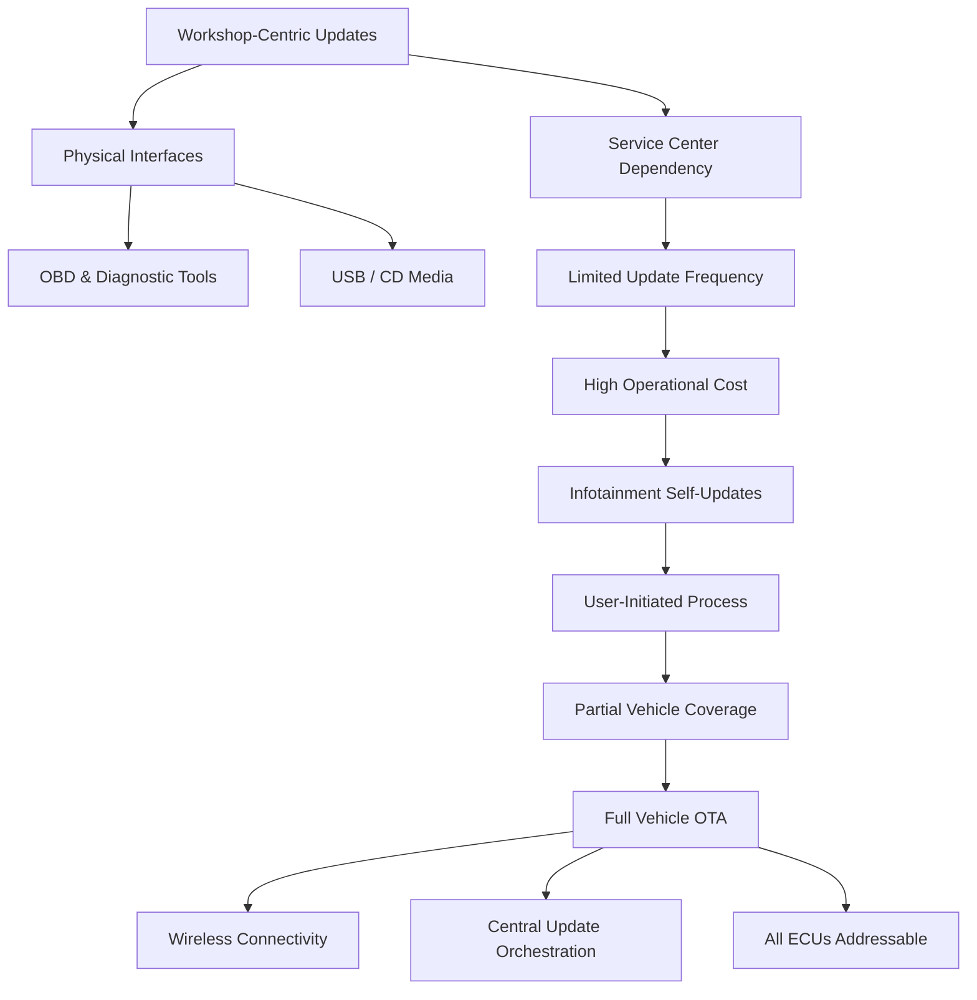
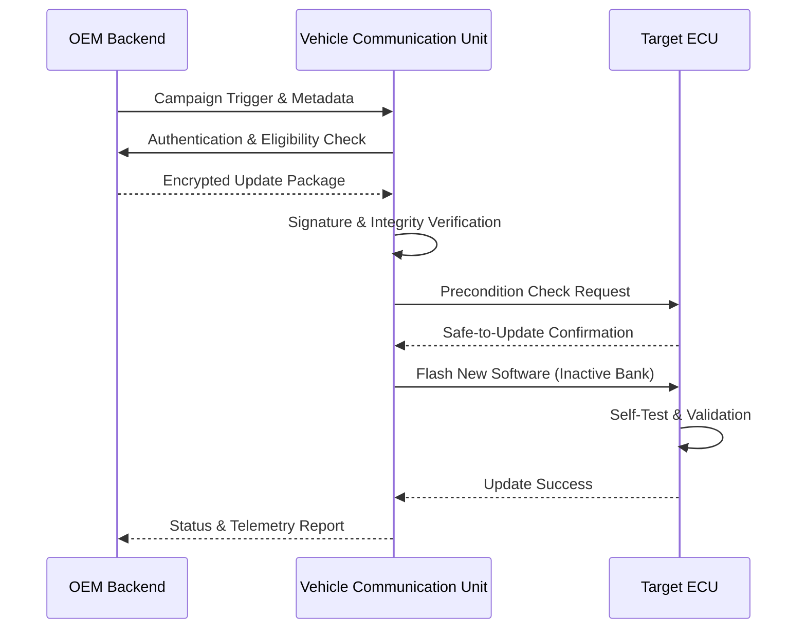

# Over-The-Air (OTA) Technology in Modern Vehicles

## Software as the Primary Vehicle Differentiator

Modern vehicles have crossed a decisive threshold where software is no longer a supporting element but the primary driver of functionality, differentiation, and long-term value. Contemporary automotive platforms consist of tens to hundreds of Electronic Control Units (ECUs), millions of lines of code, heterogeneous operating systems, and increasingly centralized computing architectures. In this environment, software engineers are no longer simply implementing features; they are custodians of safety, cybersecurity, compliance, and customer experience over a vehicle lifespan that can exceed fifteen years.

This shift has forced OEMs to rethink how vehicles evolve after production. Capabilities such as electrification, autonomous driving, vehicle-to-everything (V2X) communication, and shared mobility services are fundamentally software-defined. Features are no longer frozen at the factory gate; instead, they are continuously refined, corrected, and expanded through software updates. OTA technology is the mechanism that enables this evolution at scale.

From a systems perspective, OTA is not merely a delivery channel. It is an operational model that connects backend infrastructure, vehicle networks, safety engineering processes, and regulatory compliance into a single lifecycle. Without OTA, modern software-defined vehicles would regress into static, service-bound machines, incapable of keeping pace with security threats, legal requirements, or customer expectations.

## Traditional Software Update Methods and Their Structural Limitations

Historically, vehicle software updates followed a workshop-centric paradigm. Updates were executed through physical access to the vehicle, typically using On-Board Diagnostics (OBD) interfaces, proprietary flashing tools, and service laptops. The software itself was distributed via physical media such as CDs, DVDs, or later USB drives, often synchronized with specific vehicle identification numbers and ECU variants.

While this approach ensured a high degree of control, it imposed severe constraints on scalability and responsiveness. Each update required human intervention, vehicle downtime, and logistical coordination. The cost structure scaled linearly with fleet size, making frequent updates economically impractical. As a result, software defects often remained unpatched unless they triggered recalls or safety campaigns.

A transitional step appeared with infotainment systems. These systems, often decoupled from safety-critical domains, allowed users to download updates from OEM portals and apply them using removable media. Although this reduced service center dependency, it fragmented the update process and left the majority of ECUs untouched. The vehicle remained a patchwork of static and semi-dynamic software domains.

This fragmentation exposed a fundamental mismatch between vehicle lifecycles and software lifecycles. Software evolves continuously, while traditional vehicle update mechanisms assume infrequent, discrete interventions. OTA emerged as the only viable solution to reconcile this mismatch.

## The Transition to Over-The-Air Updates

OTA technology represents a conceptual migration from workshop-bound maintenance to cloud-connected lifecycle management. Borrowing from mobile and embedded systems domains, automotive OTA adapts the principles of remote update, staged deployment, rollback, and telemetry to the far stricter constraints of functional safety and real-time control.

In contrast to consumer electronics, vehicles must guarantee deterministic behavior, tolerate intermittent connectivity, and maintain safety guarantees even under partial update failure. This necessitates additional architectural layers, including secure boot chains, redundant memory partitions, update state machines, and strict precondition checks such as vehicle speed, battery state of charge, and ignition status.

The adoption of OTA fundamentally changes OEM operating models. Software release cycles become decoupled from model years. Security vulnerabilities can be mitigated fleet-wide within days instead of years. Features can be monetized post-sale, enabling new business models aligned with software-as-a-service principles. From an engineering standpoint, OTA forces tighter integration between DevOps pipelines, homologation processes, and vehicle configuration management.

## OTA System Architecture in the Automotive Context

A modern automotive OTA system is a distributed architecture spanning cloud infrastructure and in-vehicle platforms. On the backend side, OEM servers manage software artifacts, vehicle eligibility rules, campaign orchestration, cryptographic signing, and compliance logging. On the vehicle side, a central gateway or Vehicle Communication Unit (VCU) mediates connectivity, security enforcement, and distribution of update payloads to target ECUs over in-vehicle networks such as CAN, FlexRay, Automotive Ethernet, or LIN.

The following diagram illustrates the logical flow from legacy updates to full-vehicle OTA adoption.

At runtime, OTA updates follow a carefully controlled sequence. Update campaigns are typically initiated by the OEM backend, but execution depends on vehicle-side validation. Secure communication channels, commonly based on TLS with mutual authentication, are established before any payload transfer begins. Each update package is cryptographically signed, versioned, and mapped to a precise ECU configuration to prevent incompatibility.

The update execution itself often relies on dual-bank or A/B partitioning strategies. This allows the ECU to install new software alongside the existing version and switch only after successful validation, ensuring rollback capability in case of failure. Such mechanisms are essential to meet ISO 26262 functional safety requirements and ISO/SAE 21434 cybersecurity standards.

The following sequence diagram captures a simplified but representative OTA update flow.

## Safety, Security, and Compliance Implications

OTA systems operate at the intersection of safety-critical engineering and cybersecurity. Any update mechanism capable of modifying vehicle behavior must be resilient against both accidental faults and malicious attacks. This is why OTA architectures are inseparable from secure boot, hardware security modules (HSMs), and end-to-end cryptographic trust chains.

From a regulatory perspective, OTA updates increasingly fall under type approval and post-registration compliance. Regulations such as UNECE R156 mandate that OEMs demonstrate control, traceability, and auditability of software updates throughout the vehicle lifecycle. This includes the ability to prove what software version is installed on which vehicle at any point in time and to prevent unauthorized modifications.

OTA also changes the nature of recalls. Software defects that once required physical recalls can now be resolved remotely, dramatically reducing cost and customer disruption. However, this also raises expectations from regulators and consumers that software issues will be addressed rapidly, shifting responsibility further toward OEM software organizations.

## Application Domains: Safety-Critical and User-Facing Systems

OTA updates span both safety-critical driver control systems and user-facing infotainment domains. In the safety domain, OTA enables continuous improvement of ADAS algorithms, sensor fusion logic, and control strategies. These updates are subject to rigorous validation, often involving staged rollouts, shadow mode deployment, and extensive monitoring before full activation.

Infotainment systems, while less safety-critical, represent a major cybersecurity surface due to their connectivity and access to personal data. OTA ensures that these systems receive timely security patches, map updates, and feature enhancements, aligning vehicle user experience with the expectations set by smartphones and consumer electronics.

The unifying principle across both domains is that OTA transforms the vehicle into a living system rather than a static product. Software updates are no longer exceptional events but an integral part of normal vehicle operation.

## Conclusion: OTA as the Backbone of Software-Defined Vehicles

Over-The-Air technology is not an optional convenience but a foundational capability for modern and future vehicles. As architectures shift toward centralized compute platforms and domain controllers, OTA becomes the primary interface through which vehicles evolve, remain secure, and comply with regulatory and market demands.

In practical terms, OTA enables OEMs to treat vehicles as long-lived software platforms, continuously refined through data, feedback, and innovation. In conceptual terms, it represents a profound shift in how we define what a vehicle is: no longer a finished product at delivery, but an evolving system whose capabilities are limited more by imagination and governance than by hardware.

## References

*   **ISO 26262:** [Functional Safety for Road Vehicles](https://www.iso.org/standard/68383.html)
*   **UNECE R156:** [Software Update and Software Update Management System](https://unece.org/transport/vehicle-regulations/unece-regulation-no-156)
*   **NHTSA:** [Vehicle Software Updates Policy and Safety](https://www.nhtsa.gov/road-safety/vehicle-software-updates)
*   **AUTOSAR:** [Classic Platform Standards](https://www.autosar.org/standards/classic-platform/)
*   **SAE J3061:** [Cybersecurity Guidebook for Cyber-Physical Vehicle Systems](https://www.sae.org/standards/content/j3061_201601/)

