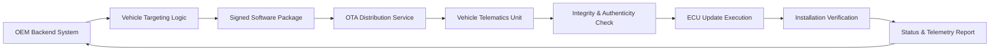
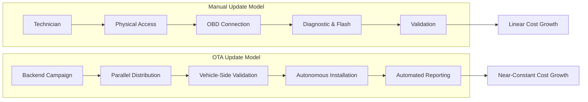

# OTA Updates in Automotive Environments

## Introduction and OEM-Centric Context

Over-The-Air update technology has become a structural necessity in modern automotive ecosystems, particularly when viewed from the operational reality of an Original Equipment Manufacturer rather than from the perspective of an individual vehicle owner. While manual diagnostic and software update procedures remain technically viable for servicing a single vehicle, they fail catastrophically when confronted with the scale, velocity, and complexity of modern vehicle production and fleet management.

OEMs operate in an environment where software defects, calibration mismatches, cybersecurity vulnerabilities, and regulatory updates can affect tens of thousands of vehicles simultaneously. In this context, OTA is not primarily a customer convenience feature but a production, compliance, and risk-mitigation mechanism. It enables OEMs to treat vehicle software as a continuously managed asset across manufacturing, logistics, pre-delivery storage, and post-sale operation.

From a systems viewpoint, OTA bridges the gap between backend software lifecycle management and embedded automotive systems that were historically isolated after production. Without OTA, the increasing software content of vehicles would render large-scale operations economically and logistically unsustainable.

## Manual Service Model and Its Structural Constraints

The traditional automotive service model is rooted in physical access and human intervention. When a vehicle exhibits a software-related issue, the established workflow requires the customer to visit a certified service station, where trained technicians connect diagnostic equipment through the On-Board Diagnostics interface. Diagnostic routines are executed, fault codes are interpreted, and software updates are applied using manufacturer-specific flashing tools.

This model scales poorly even under moderate load. Modern vehicles routinely contain between thirty and forty ECUs, with premium or highly automated platforms exceeding fifty. Each ECU may have distinct software versions, dependencies, and update procedures. Technicians must therefore perform a series of sequential actions, often constrained by physical access to the vehicle, the availability of tools, and the current state of the vehicle itself.

Environmental and logistical variables further complicate this process. Vehicles may be stored outdoors, exposed to weather, parked in dense storage yards, or delivered with partially charged batteries unsuitable for flashing operations. Each of these factors introduces delays and risks that compound across large vehicle populations. Most critically, the manual service model scales linearly: every additional vehicle requires a proportional increase in technician time, equipment usage, and operational cost.

## Scale Amplification in OEM Production and Logistics

The limitations of manual updates become starkly visible at OEM scale. Manufacturing plants routinely produce thousands of vehicles per day, which are then staged in logistics yards, ports, or distribution centers awaiting shipment or customer delivery. If a software issue is identified in a specific ECU batch, hardware revision, or production time window, the OEM must remediate the issue across all affected vehicles before release.

A hypothetical update affecting forty thousand vehicles illustrates the infeasibility of manual intervention. Even a minor software change, such as a sensor threshold adjustment or warning logic correction, would require technicians to physically locate each vehicle, establish diagnostic connections, ensure adequate power conditions, and perform flashing and validation procedures. Weather exposure, yard congestion, and limited technician availability quickly turn such an operation into a logistical bottleneck with significant financial impact.

At this scale, delays translate directly into delayed deliveries, increased holding costs, and reputational risk. The manual model, originally designed for post-sale servicing, is fundamentally incompatible with pre-delivery fleet-wide software management.

## OTA Update Architecture and End-to-End Workflow

OTA update systems address these challenges by introducing centralized orchestration and decentralized execution. The core architectural principle is that update decisions and campaign management are handled centrally, while execution is delegated to the vehicle itself under controlled conditions.

From the backend perspective, OEM systems maintain a continuously updated view of vehicle configurations, including ECU hardware identifiers, software versions, production metadata, and connectivity status. When an update is required, the backend identifies the affected vehicle population and associates the correct software artifacts with that population. These artifacts are cryptographically signed, versioned, and stored in a secure repository.

Vehicles receive update notifications through their telematics or connectivity units. Upon reception, the vehicle validates the authenticity and integrity of the package before proceeding. Installation is governed by strict preconditions such as vehicle state, battery charge level, and safety constraints. The vehicle then performs the update autonomously and reports detailed status information back to the backend.

The following diagram illustrates this closed-loop OTA workflow from backend orchestration to ECU update and confirmation.

This architecture allows thousands of vehicles to update in parallel while preserving control, traceability, and rollback capability. The human role shifts from manual execution to campaign design, monitoring, and exception handling.

## Manual Versus OTA Processes at a Systems Level

The fundamental distinction between manual and OTA update methodologies lies in how they scale. Manual updates are inherently sequential and resource-bound. Each step depends on physical presence, making parallelization limited and costly. Even with large technician teams, the process remains constrained by access and time.

OTA systems invert this relationship. The backend infrastructure scales independently of the number of vehicles, and each vehicle executes the update autonomously once triggered. While network capacity and backend performance must be engineered carefully, the marginal cost of updating an additional vehicle approaches zero compared to manual methods.

The contrast between these models can be visualized as two fundamentally different process graphs.

This architectural shift transforms software updates from an operational liability into a controllable, repeatable process aligned with modern software engineering practices.

## Operational Preconditions and Strategic Impact

Implementing OTA is not without prerequisites. Vehicles must be designed with connectivity, secure boot mechanisms, sufficient memory, and update-safe architectures such as dual banks or fallback partitions. Backend systems must integrate cybersecurity, vehicle configuration management, and regulatory compliance into a unified platform. Update strategies must account for intermittent connectivity, varying power conditions, and heterogeneous vehicle states.

Despite these requirements, the strategic impact of OTA is decisive. OEMs gain the ability to correct issues before vehicles reach customers, respond rapidly to cybersecurity threats, and maintain software consistency across global fleets. OTA also enables new development and business models, including feature activation, staged rollouts, and continuous improvement cycles that extend well beyond the point of sale.

In practical terms, OTA transforms vehicle software management from a reactive service activity into a proactive operational capability. It allows OEMs to maintain control over increasingly complex vehicle software ecosystems while reducing cost, risk, and dependency on physical intervention.

## Conclusion

Over-The-Air update technology is no longer an optional enhancement but a foundational element of modern automotive operations. From an OEM perspective, it is the only scalable solution to managing software across large, distributed vehicle fleets. As vehicles continue to evolve into software-defined systems, OTA serves as the connective tissue between backend engineering processes and embedded automotive platforms.

The shift from manual to OTA updates reflects a deeper transformation in the automotive industry: vehicles are no longer static products delivered once, but dynamic systems that evolve continuously. OTA is the mechanism that makes this evolution operationally feasible.

## References

- [UNECE Regulation No. 156: Software Update and Software Update Management System](https://unece.org/transport/vehicle-regulations/unece-regulation-no-156)
- [ISO 24089: Software Update Engineering](https://www.iso.org/standard/68383.html)
- [AUTOSAR Adaptive Platform Standards](https://www.autosar.org/standards/adaptive-platform/)
- [NHTSA: Vehicle Software Updates](https://www.nhtsa.gov/road-safety/vehicle-software-updates)
- [SAE J3061: Cybersecurity Guidebook for Cyber-Physical Vehicle Systems](https://www.sae.org/standards/content/j3061_201601/)
