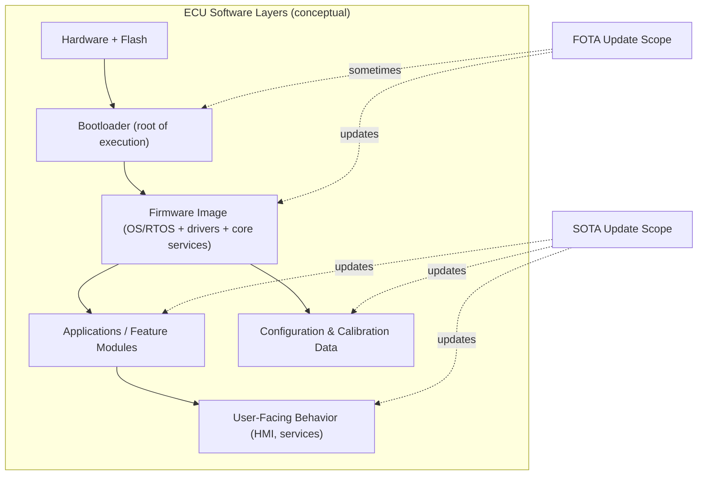
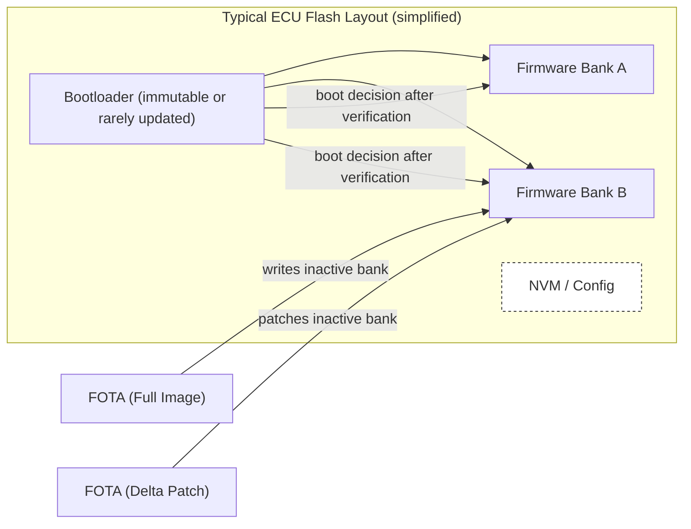
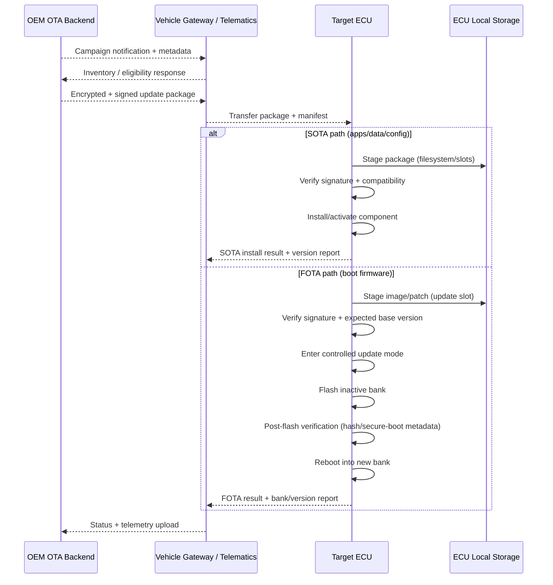
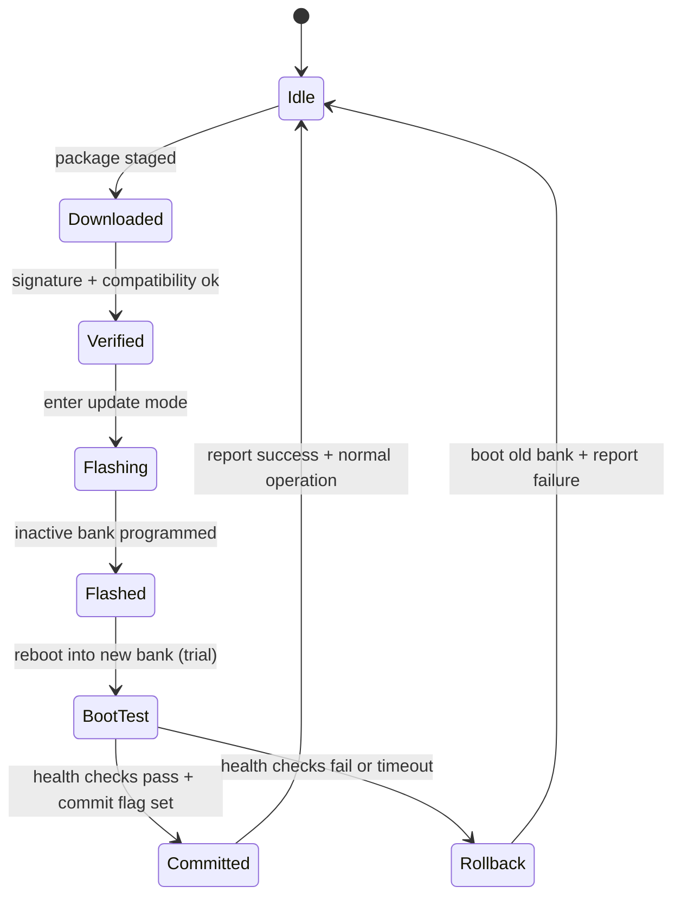

# SOTA vs. FOTA in Automotive OTA Systems

## OTA update mechanisms in the vehicle software stack

Over-The-Air updates in vehicles exist because the software stack inside a modern ECU is not a single thing. It is a layered system where some components behave like “apps and data” and other components behave like “the thing that lets the ECU exist at all.” SOTA and FOTA are names for updating different layers of that stack over a wireless channel, and the distinction matters because each layer has different failure modes, different safety implications, and different architectural requirements for storage, rollback, and validation.

A useful mental model is to treat the ECU as a small embedded computer with a chain of trust. At the bottom sits hardware and flash memory. Very early in the boot sequence a minimal bootloader runs, then it hands control to a firmware image that provides the runtime environment and core ECU behavior. Above that, depending on ECU type, you may have application processes, feature modules, configuration datasets, and large content bundles such as maps or media assets. SOTA targets the upper layers where modularity is expected. FOTA targets the foundational image (and sometimes the bootloader itself, under stricter rules) where an interrupted update can brick the unit if recoverability is not engineered in.

## Software Over-The-Air (SOTA): architecture and operational scope

Software Over-The-Air in automotive contexts refers to delivering updateable software components that are not the core firmware image that boots the ECU. In practice, SOTA includes executable applications, service modules, feature packages, configuration datasets (maps, calibration, parameter tables), and security-related payloads such as policy files, certificate bundles, and application-level patch sets. The common property is that these artifacts can be represented as files or modular packages and applied through an update manager without rewriting the monolithic boot firmware image.

SOTA-friendly systems usually expose an internal storage abstraction that behaves like a filesystem or an object store. In high-end infotainment and domain compute platforms this may be a Linux filesystem with A/B partitions and package management semantics. In smaller ECUs it may be a constrained flash filesystem or a vendor-specific “slot” layout. The key requirement is that the update mechanism can add, replace, or remove modules without destabilizing the boot-critical chain. This is why SOTA often updates fast-moving user-facing functionality while keeping the boot foundation stable.

From an OEM operations perspective, SOTA is the workhorse for frequent iteration because it allows a high cadence of improvements with comparatively lower risk. A navigation map update, a media codec fix, a calibration dataset refresh, or a non-boot-critical application patch can usually be scheduled flexibly and may even be applied with reduced downtime, depending on the ECU’s role and system constraints.

A subtle but important point is that SOTA is not “non-critical by definition.” A calibration dataset can affect vehicle behavior, and some vehicles treat calibrations as safety-relevant. The engineering distinction is not “critical vs non-critical,” but “boot image replacement vs modular component update,” which then drives the recoverability and validation strategy.

## Firmware Over-The-Air (FOTA): technical characteristics and why it’s scarier

Firmware Over-The-Air updates the software image that resides in non-volatile flash and is required for the ECU to boot into its intended operational state. In classic embedded ECUs the firmware image is often a largely monolithic build artifact containing the RTOS or runtime environment, drivers, diagnostic services, and core ECU logic. Even when internally modular, it is typically flashed as a single unit (or a small set of tightly coupled partitions). If that image is corrupted or only partially written, the ECU may not start, and the vehicle may lose functions ranging from “annoying” to “unsafe.”

FOTA payloads are commonly delivered as either a full image replacement or a differential update. Full images are conceptually simpler and reduce the risk of patch-application edge cases, but they increase download size, flash time, and power risk. Differential updates reduce bandwidth and time but require careful base-version control, robust patch application, and strong verification that the target is exactly the expected prior image.

Most production-grade FOTA designs rely on a bootloader that can enforce the update protocol, validate cryptographic signatures, and decide which firmware bank to boot. The bootloader becomes the safety net. If the bootloader is itself updated, the system must treat that as a high-assurance event with additional safeguards because it is part of the recovery path.

## Comparative behavior: scope, failure modes, and why the same OTA pipe feels different

SOTA and FOTA can share the same transport channel, the same backend campaign tooling, and the same vehicle gateway. What changes is the in-ECU application model and the risk envelope. SOTA usually modifies artifacts that can be versioned, staged, and rolled back at the application or data layer. If a SOTA update fails, the system typically remains bootable and can often revert by reinstalling the previous application package or toggling an active version pointer.

FOTA modifies the foundational boot image. The principal failure mode is not “feature regression” but “loss of boot.” That is why FOTA demands stricter preconditions, stronger atomicity guarantees, and typically a reboot boundary. In many architectures, SOTA can be applied while the system is running (with service restarts), whereas FOTA requires a controlled transition into an update state, flash programming of an inactive bank, and a secure boot validation at restart.

The time dimension also differs. SOTA packages are often smaller and write to storage designed for frequent changes. FOTA packages are larger and involve flash erase/write cycles on boot partitions, which are time-consuming and power-sensitive.

## System architecture and update flow for SOTA and FOTA

At the fleet level, both SOTA and FOTA are orchestrated as campaigns: the backend identifies a target population by variant, hardware revision, current software inventory, and eligibility rules; a package is selected and made available; vehicles fetch, validate, install, and report status. The vehicle gateway often acts as a traffic director, but the ECU (or its local update agent) must enforce safety conditions and integrity checks.

The flow below shows how the shared OTA channel splits into distinct installation paths once the payload reaches the ECU.

## Storage and rollback design: where the real engineering hides

SOTA storage is usually engineered for churn. The update agent can keep multiple versions of an app, multiple dataset revisions, or a staged “next” configuration. Rollback can be as simple as switching a symlink, flipping a version pointer, or restoring a previous file set, depending on platform maturity. Even so, safe rollback still needs clear dependency modeling, because an application may expect a matching configuration schema or API version.

FOTA storage is engineered for atomicity. Dual-bank (A/B) firmware is common because it allows programming an inactive bank while the active one continues to boot a known-good image. The bootloader then selects the new bank only after verification. If the new image fails health checks, the bootloader can revert. Some ECUs implement a “golden image” recovery partition or require a minimal boot stub that can always accept a rescue update. The design goal is to ensure that a power loss during flashing does not destroy the only bootable image.

A practical way to describe FOTA robustness is as a state machine with explicit commit points. Until the update is committed, the ECU must be able to boot the old image.

## Risk management: why SOTA is “usually safer,” and why that’s not a free pass

SOTA tends to be lower risk because the ECU remains bootable even if an application component is broken. That practical advantage often enables more aggressive rollout strategies such as staged deployments, canary groups, and rapid iteration. The rollback mechanism can be quick and may not require a full reboot, depending on the software architecture. However, SOTA still needs rigorous controls when the updated artifact influences vehicle behavior, because a configuration file can be as behavior-changing as compiled code.

FOTA requires a more conservative posture. The ECU often must ensure stable power conditions, because flash erase/write cycles are vulnerable to interruption. It must also ensure it is in a safe operational state, because the ECU may be unavailable during flashing and reboot. Integrity verification is mandatory before flashing, and post-flash verification is mandatory before commit. In safety-oriented designs, the ECU additionally performs runtime sanity checks after boot, and only then commits the bank switch.

From an OEM campaign perspective, the control plane for both SOTA and FOTA should enforce traceability, inventory correctness, and auditable records of what was offered, what was installed, and what failed. This is not only good engineering practice; it is increasingly tied to regulatory expectations around software update governance.

## Conclusion: complementary mechanisms that enable fleet-scale lifecycle control

SOTA and FOTA are best understood as complementary layers of the same OTA capability. SOTA provides the agility needed to update applications, content, and configuration at a cadence that matches modern software development. FOTA provides the controlled means to evolve the boot-critical firmware foundation, which is essential for long-term maintenance, security hardening, and deep functional changes that cannot be expressed as higher-level packages. The choice between them is fundamentally determined by what layer must change to achieve the intended effect, and the resulting safety, recoverability, and validation requirements.

## References

- [UN Regulation No. 156: Software Update and Software Update Management System](https://unece.org/transport/vehicle-regulations/unece-regulation-no-156)
- [ISO 24089: Road vehicles — Software update engineering](https://www.iso.org/standard/68383.html)
- [ISO/SAE 21434: Road vehicles — Cybersecurity engineering](https://www.iso.org/standard/70918.html)
- [SAE J3061: Cybersecurity Guidebook for Cyber-Physical Vehicle Systems](https://www.sae.org/standards/content/j3061_201601/)
- [AUTOSAR Classic Platform](https://www.autosar.org/standards/classic-platform/)
- [AUTOSAR Adaptive Platform](https://www.autosar.org/standards/adaptive-platform/)
