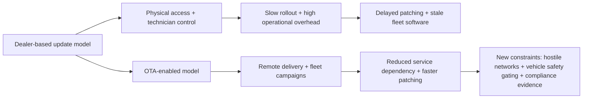
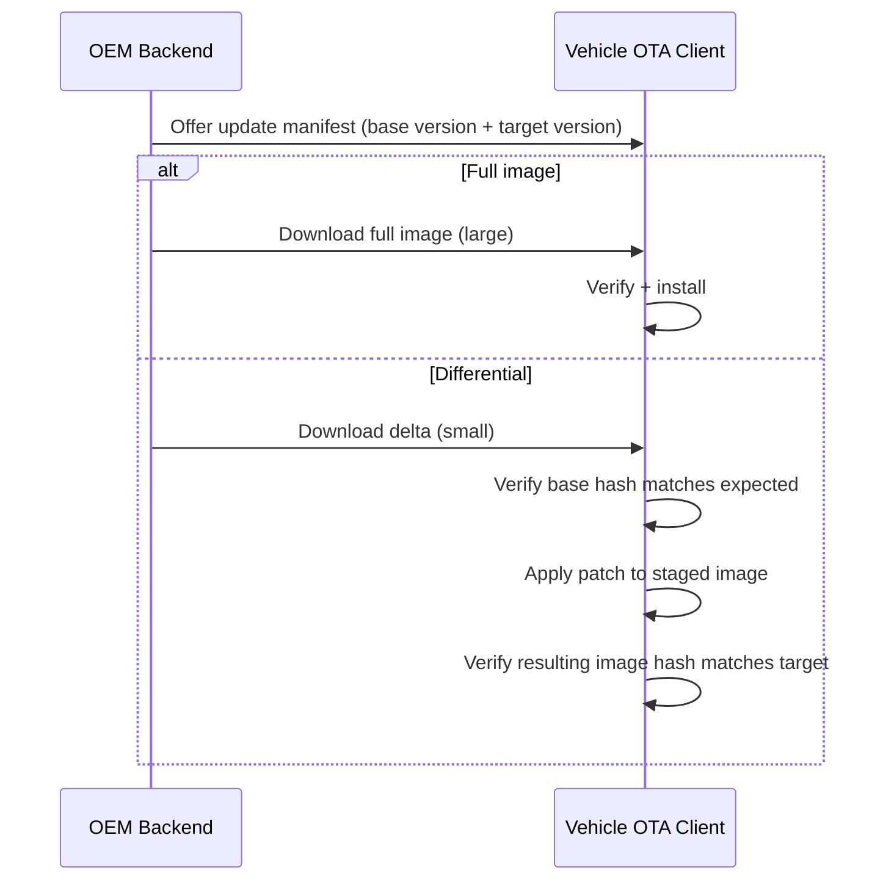
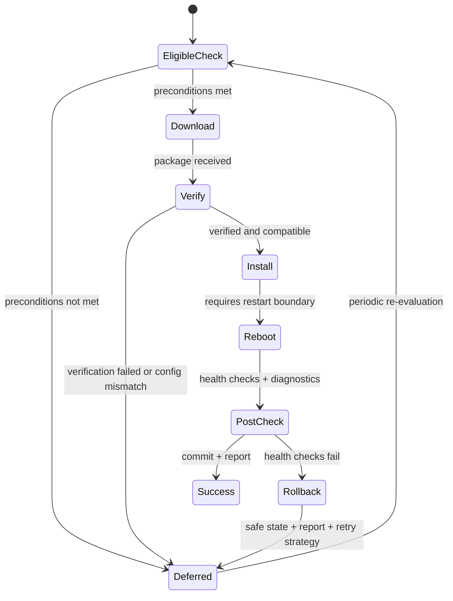
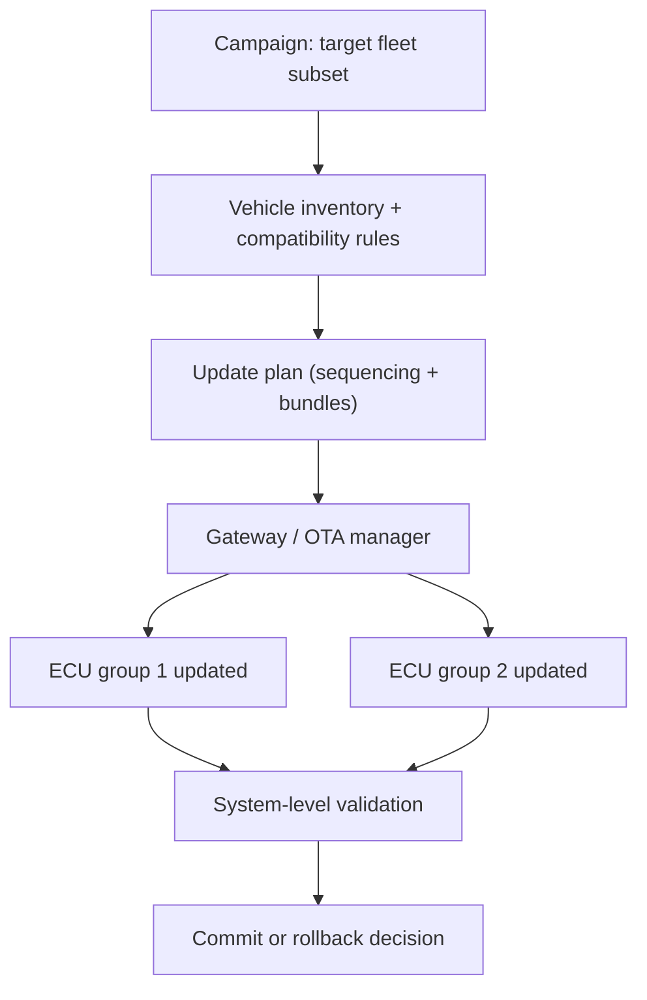
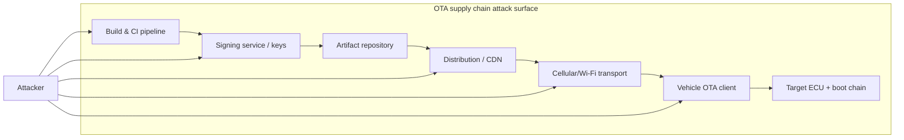
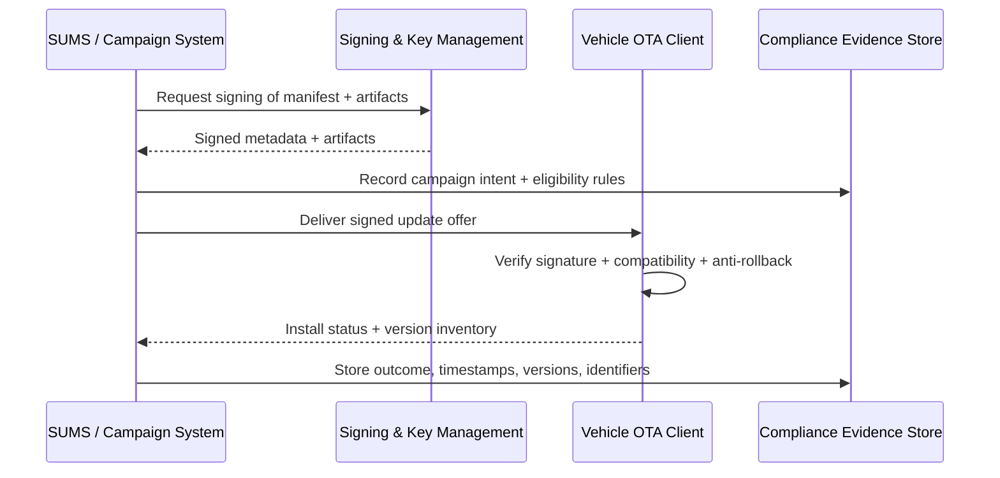
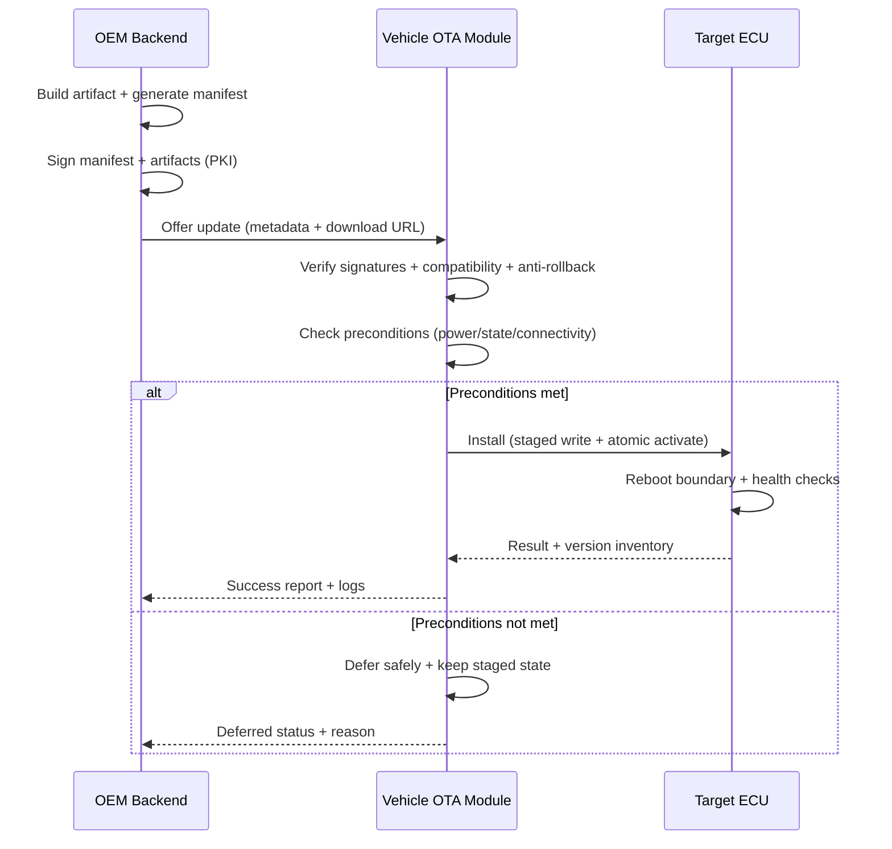

# Challenges of Automotive Over-The-Air Updates

## Introduction

Over-The-Air updates changed the economics of vehicle software maintenance by removing the service-bay bottleneck, but they also dragged the automotive world into the same hostile network reality that phones and servers have lived in for decades. The difference is that a failed phone update is irritating, while a failed vehicle update can remove braking assist, break diagnostics, or strand a customer. Automotive OTA therefore becomes a system-of-systems problem: distributed embedded devices, intermittent connectivity, strict safety constraints, long product lifecycles, and attackers who only need one weak link.

The practical consequence is that “OTA” is never just a downloader. It is an end-to-end lifecycle mechanism that spans backend release governance, cryptographic trust, campaign targeting, in-vehicle safety gating, robust installation, rollback, and evidence generation for regulators.

## The shift from dealer-based updates to OTA and why the problems mutate instead of disappearing

Dealer-based updates were operationally inefficient, but they were physically contained. A technician’s diagnostic tool, an OBD cable, and a controlled workshop environment naturally limited the attack surface and gave humans the chance to notice when something went wrong. That model created administrative overhead, scheduling friction, and update avoidance, which left vehicles running stale software longer than anyone should be comfortable with.

OTA flips those constraints. Updates become fast, scalable, and fleet-wide, but the environment becomes uncontrollable. Vehicles are parked in underground garages, in cold weather, with weak LTE, with low battery, or with owners who will absolutely attempt an update five minutes before a road trip. The system must survive those realities without bricking ECUs, violating safety requirements, or creating a new remote-control interface for criminals.

## Technical challenges unique to automotive OTA

### Package size, bandwidth cost, and unreliable transport

Automotive OTA lives on cellular networks more often than engineers would like, and cellular is both expensive and imperfect. Large full-image downloads increase failure probability, increase customer cost sensitivity, and elongate the time window during which a vehicle is in an “update pending” state. This is why differential updates are operationally attractive: they reduce bytes transferred and can speed up campaigns.

The trick is that differential updates create a stricter dependency on inventory correctness. A delta is only valid when applied to the exact base version it was generated for. If targeting is even slightly wrong, a delta update becomes either a failed update or, in the worst case, a corrupted image if safeguards are weak. That pushes OEMs toward cryptographically bound manifests that include “what this update expects” and “what it will produce,” plus strong rejection behavior when the base state does not match.

### Preconditions, safety gating, and “the car is not a server”

A server can reboot whenever it wants. A vehicle cannot. Automotive OTA must enforce preconditions that are essentially safety invariants dressed up as software checks. The system needs a stable power budget for the entire operation, stable in-vehicle communications, and a vehicle state that won’t endanger occupants if a subsystem is temporarily unavailable. Even when the update itself is non-safety-critical, the update mechanism may share infrastructure with safety ECUs, and the vehicle network is often too interconnected to treat any update as purely isolated.

This is why serious OTA systems implement explicit gating and state machines. The update manager should be able to pause, resume, and defer installation, and it must have a clearly defined safe failure behavior. “Try again later” is acceptable for an infotainment app; it is not acceptable for a boot firmware update mid-flash.

### Targeting correctness in a world of variants, options, and aftermarket entropy

Modern platforms are not one vehicle; they are a combinatorial space of trims, ECUs, sensors, suppliers, hardware revisions, and market-specific homologation constraints. OTA targeting must map “this software artifact” to “the vehicles that can safely run it,” which requires accurate inventories and robust configuration management. Aftermarket modifications, retrofits, and even dealer-installed options can break assumptions made during development.

Targeting errors are deceptively dangerous because they can look like normal update failures until they happen at scale. A small percentage of misidentified vehicles can still be thousands of vehicles in a fleet campaign. That is why OEMs increasingly invest in software bill of materials practices, runtime inventory reporting, and strict compatibility constraints inside manifests.

### ECU interdependence and multi-ECU orchestration

Vehicles are distributed systems. Updating a single ECU can affect timing, message schemas, diagnostic services, and assumptions in other ECUs. ADAS and gateway ECUs are particularly sensitive because they mediate data from multiple sensors and communicate across multiple networks. This pushes OTA from “install package” into “orchestrate system transition,” where the update plan must account for dependencies and sequencing.

In practice, this means campaigns often need coordination rules such as “update gateway before dependent ECUs,” or “update a set of ECUs as one logical bundle with a shared compatibility contract.” The system needs to know when partial completion is acceptable and when it is not.

## Security challenges and threat vectors

### The OTA channel is a supply chain, not just a network link

The most important security mistake is to treat OTA as “encrypt the download and we’re done.” OTA is a software supply chain that happens to terminate in a vehicle. Attacks can happen at the backend, in developer tooling, in signing infrastructure, in distribution services, in credentials, or in the vehicle itself. A secure transport channel does not protect against a compromised signing key, a poisoned build pipeline, or a malicious insider.

This is why OTA security is built around authenticity and authorization first, confidentiality second. The vehicle must be able to prove that an update is from the OEM, intended for this ECU, compatible with this configuration, and not replayed or downgraded. That implies signed metadata, anti-rollback controls, and a trusted execution environment for keys.

### Common practical attack modes

Credential theft matters because backend campaign tools are high-leverage. If an attacker can impersonate an operator, the “legitimate” pipeline can become the delivery vehicle for malicious updates. Man-in-the-middle attacks matter less when mutual authentication and signed payloads are done correctly, but they still matter for denial-of-service and for exploiting client-side parsing bugs. Spoofed access points and jamming are primarily availability threats, but availability is safety-relevant when critical patches must be deployed quickly.

A particularly nasty class of failures involves verification bypass. If the vehicle accepts unsigned or incorrectly signed payloads, or if signature verification is implemented in an update agent that can be downgraded or replaced, the OTA system becomes a remote code execution interface. Strong designs root trust in the boot chain and hardware-backed key storage so that verification cannot be “updated away.”

Frameworks like Uptane exist precisely because automotive OTA needs compromise resilience, meaning the system should limit damage even if parts of the infrastructure are breached. Uptane’s design emphasizes signed metadata, role separation, and protection against replay and rollback scenarios.

## Regulatory and standards landscape: why OTA governance is now part of type approval

OTA security and process control are no longer “best practice.” In many markets they are type-approval requirements. UNECE Regulation No. 156 formalizes expectations around a Software Update Management System (SUMS), requiring OEMs to demonstrate control over update delivery, traceability, and the ability to manage risks introduced by software changes. UNECE Regulation No. 155 complements this by requiring a Cyber Security Management System (CSMS), pushing OEMs to implement systematic cybersecurity governance across the vehicle lifecycle. ISO/SAE 21434 provides an engineering framework for cybersecurity risk management that aligns well with the CSMS expectations, and standards such as ISO 24089 focus more directly on software update engineering processes.

From an OTA implementation standpoint, regulation forces you to treat evidence as a first-class output. It’s not enough to update vehicles safely; you must be able to prove what was installed, on which vehicles, under what authorization, with what verification, and with what result.

## Why automotive OTA is not mobile OTA, even when the plumbing looks similar

Phones are usually single-node systems with a user who can tolerate downtime and retry loops. Vehicles are multi-node real-time systems with safety functions and legal constraints. The update must account for driving state, power variability, thermal conditions, and the possibility that an ECU is required to ensure safety even during an update attempt. The system must handle partial connectivity, ensure that an interrupted update does not brick critical units, and coordinate multiple ECUs that collectively implement one feature.

The most visible difference is recoverability. Mobile devices can often afford a “factory reset” narrative. Vehicles cannot. Automotive OTA has to assume that a vehicle may need to remain operable even after a failed update, or must transition into a defined safe state. That requirement drives A/B firmware banks, rollback logic, post-install health checks, and conservative commit semantics.

## Secure OTA update process, end to end

A secure automotive OTA process begins before any bytes are transmitted. The build pipeline produces artifacts, a manifest binds those artifacts to explicit compatibility constraints, and the entire bundle is signed using keys that are protected by strong operational controls. Distribution happens over encrypted channels, but the critical safety property is that the vehicle verifies signatures and manifest rules locally, using trust anchored in hardware-backed storage and secure boot.

On the vehicle, the OTA client performs configuration matching and gating based on power, vehicle state, and network stability. Installation proceeds in a controlled manner, ideally into an inactive firmware bank for FOTA scenarios, and activation occurs only after post-install validation. The system reports status and inventory to the backend, and evidence is persisted to satisfy operational forensics and regulatory audits.

## Conclusion

Automotive OTA replaces dealer friction with engineering complexity. The hard problems are not “how to download a file,” but how to guarantee safety under interruption, guarantee authenticity under attack, guarantee correctness under variant explosion, and guarantee evidence under regulation. Package optimization pushes you toward differential strategies, but differential strategies make targeting accuracy and inventory integrity non-negotiable. Security pushes you toward signed metadata and hardware-rooted verification, but operational reality pushes you toward resilience against partial outages and compromised infrastructure. Regulation pushes all of it into a governance frame where the process must be auditable, repeatable, and demonstrably controlled.

If OTA is done well, it becomes a quiet superpower: faster security patching, fewer recalls, healthier fleets, and a vehicle platform that can improve over time without constantly visiting a workshop. If it is done poorly, it becomes a fleet-scale remote exploit surface with wheels.

## References

### Regulatory Standards
- **UNECE R156**: [Software Update and Software Update Management System (SUMS)](https://unece.org/transport/documents/2021/03/standards/un-regulation-no-156-software-update-and-software-update-management-system)
- **UNECE R155**: [Cyber Security and Cyber Security Management System (CSMS)](https://unece.org/transport/documents/2021/03/standards/un-regulation-no-155-cyber-security-and-cyber-security)

### Industry Standards & Frameworks
- **ISO/SAE 21434**: [Road vehicles — Cybersecurity engineering](https://www.iso.org/standard/70918.html)
- **SAE J3061**: [Cybersecurity guidebook for cyber-physical vehicle systems](https://www.sae.org/standards/content/j3061_201601/)
- **Uptane**: [Secure software update framework for automobiles](https://uptane.org/)

### General Resources
- **NHTSA**: [Overview of vehicle software updates](https://www.nhtsa.gov/road-safety/vehicle-software-updates)
