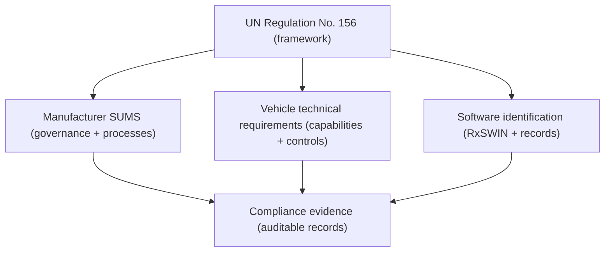
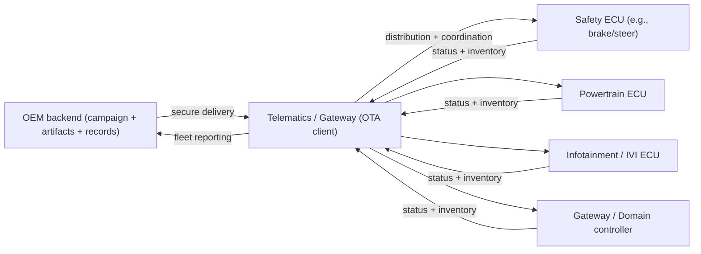
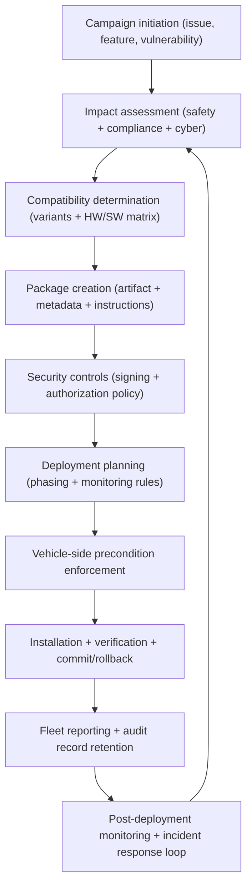
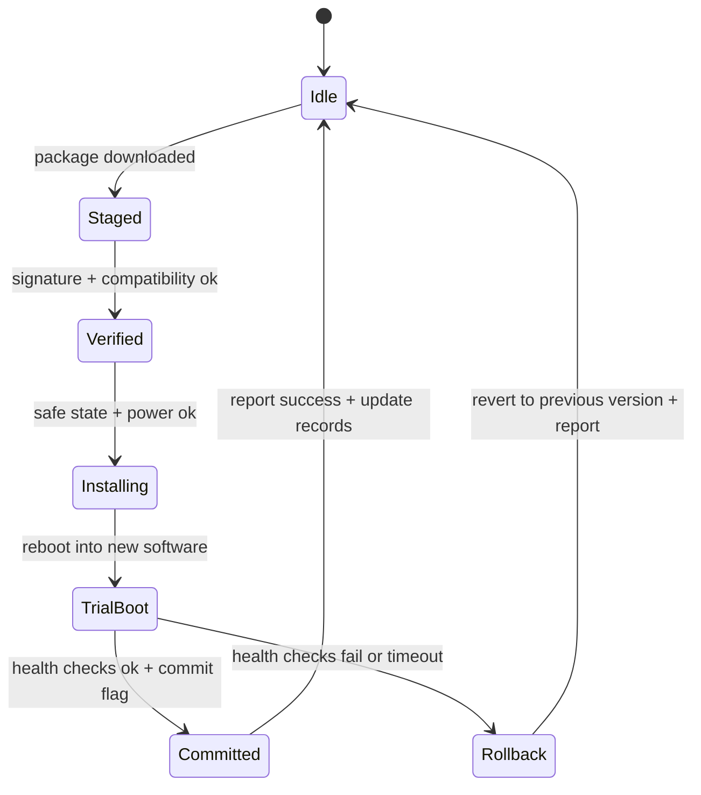

# UN Regulation No. 156: Software Update Management System Framework

## OTA updates in type approval reality

Connected vehicles now depend on software across domains that regulators historically treated as “hardware behavior.” Powertrain control, braking and steering functions, body controllers, infotainment, telematics, and gateway routing increasingly ship as software-defined systems whose behavior can change after the vehicle is placed on the market. OTA makes those changes operationally feasible by allowing an OEM backend to deliver software packages through a telematics unit or in-vehicle gateway to specific ECUs, with the vehicle executing verification and installation locally.

That ability is powerful and dangerous in equal measure. A failed installation can strand an ECU in a non-bootable state, an unsafe precondition can turn a routine update into a safety event, and a compromised update pipeline can become an at-scale remote control channel. UN Regulation No. 156 exists because “we do updates” is not a safety case. Regulators want evidence that updates are governed end-to-end as a controlled system, with traceability of what was installed, on which vehicles, by whose authority, and with what verification.

UNECE R156 is therefore less a technical recipe and more a framework for demonstrating that your organization and your vehicle platform jointly constitute a Software Update Management System (SUMS) that is effective in operation, not merely in design. The UNECE regulation text is published by UNECE. ([UNECE][1])

## What UNR156 is trying to control

UNR156 is issued under UNECE WP.29 and defines uniform provisions related to software updates and the Software Update Management System. It doesn’t dictate whether you use Uptane-style metadata, a particular PKI, or a specific backend architecture. Instead, it demands that the manufacturer can demonstrate governance, risk management, and technical controls for software updates throughout the vehicle lifecycle, with particular emphasis on updates that affect type approval relevant systems.

In plain engineering terms, regulators are asking you to treat software updates as a controlled change-management system for a safety- and compliance-relevant product. That includes managing the update supply chain, ensuring that updates are only applied when safe, preventing unauthorized modification or rollback to vulnerable versions, and maintaining auditable records so authorities can verify conformity. The concept of SUMS as a systematic organizational approach is also reflected in the EU’s incorporation of the regulation, including a definition of SUMS. ([EUR-Lex][2])

## The compliance frame: three coupled systems, not one

UNR156 compliance emerges from the coupling of three things: the manufacturer’s SUMS processes, the vehicle’s technical capabilities, and the software identification/traceability model. The regulation organizes requirements in that spirit, because you cannot “secure OTA” with only vehicle-side crypto, and you cannot satisfy type approval with only backend process documents. You need both, plus consistent identification of software versions relevant for approval.

This “triad” is the practical lens for designing a compliant OTA program. Every engineering decision eventually has to land in one of these buckets and produce evidence that a type approval authority can review.

## OTA architecture under UNR156: where the backend ends and the vehicle begins

The regulation assumes a typical connected-vehicle OTA architecture: an OEM backend that orchestrates campaigns and serves update artifacts, a vehicle connectivity element (TCU or gateway) that bridges the external network into the in-vehicle network, and target ECUs that validate and install updates. The regulation’s intent is that security and control are maintained through the entire path, not just at the edges.

UNR156 doesn’t require that every ECU talks directly to the cloud; it requires that the update system as implemented ensures authenticity, integrity, safe execution, traceability, and controlled change management. The architectural patterns OEMs use to achieve that vary, but the compliance questions remain stubbornly similar.

## SUMS: the manufacturer-side system that regulators actually care about

Section 7.1 of the regulation focuses on the Software Update Management System as a manufacturer capability. Conceptually, SUMS is the operating system for your OTA program: it defines how you decide an update exists, how you assess risk, how you validate compatibility, how you authorize release, how you control distribution, how you record what happened, and how you react when the world behaves badly.

A compliant SUMS ties together software configuration management, hardware/software compatibility rules, cybersecurity risk management, safety impact assessment, and operational monitoring into one governed process. The key subtlety is that “process” here is not paperwork; it must be reflected in tooling and controls. If a manufacturer claims that only approved packages can be installed, then the signing process, key management, manifest enforcement, and backend authorization flows must make it true in practice.

A useful way to view SUMS is as a gated pipeline where each gate produces evidence. Compatibility gates ensure the right vehicles get the right packages. Security gates ensure only authentic packages exist and can be accepted. Operational safety gates ensure installation occurs only under preconditions. Post-update gates ensure the vehicle ended in a conforming state.

This is the “living system” aspect: SUMS is expected to keep working as threats evolve, suppliers change, and new vehicle variants appear.

## Preconditions: why “safe to install” is a regulated concept

UNR156 pushes OEMs to define and enforce preconditions for updates, especially for systems with safety relevance. Preconditions are the engineering translation of “don’t do dangerous maintenance while driving.” For safety ECUs, that may mean vehicle stationary, parking brake applied, stable voltage, and a controlled update mode with limited functionality. For infotainment, it may mean less restrictive rules, but still rules that prevent corruption, privacy violations, or customer lockout.

The reason regulators care is that OTA turns installation into a distributed autonomous act. If the backend can cause installation, then the vehicle must be designed to refuse installation when unsafe. This is also where your vehicle-side state machine becomes part of the compliance story: authorities want to see that you have defined when an update is allowed, how you detect the allowed state, and what you do when the state changes mid-process.

## Software identification and RxSWIN: traceability that survives time and supply chains

A core compliance pillar in UNR156 is software identification, and the regulation introduces the idea of a Regulation Software Identification Number, commonly referenced as RxSWIN in industry discussions. The “X” is meant to tie software identification to regulation-relevant systems, so authorities can verify that the installed software corresponds to approved behavior. The practical outcome is that vehicles must be able to report software identifiers, and manufacturers must be able to map those identifiers to artifacts, approvals, and compatibility constraints.

This requirement exists because OTA makes software fluid. If software can change post-approval, regulators need a stable identifier that can be read and checked, and an OEM needs a record system that can prove what was installed and why it is still conforming. The UNECE text is the authoritative source for the regulation’s software update and identification provisions. ([UNECE][1])

## Vehicle technical requirements: authenticity, integrity, anti-rollback, and recoverability

UNR156 expects the vehicle to enforce technical controls that make the SUMS promises real. Authenticity and integrity checks are the obvious ones: the ECU or OTA client must verify that a package came from an authorized source and wasn’t modified. In practice, that implies cryptographic signatures, a trust anchor, and secure handling of keys. Anti-rollback protections matter because an attacker (or even a misconfigured campaign) could try to install an older but vulnerable version, effectively reintroducing known weaknesses. Robust systems bind version acceptance to monotonic counters, signed metadata, or policy rules enforced in a hardware-backed trust domain.

Recoverability is the other quiet giant. Vehicles must handle failed updates without turning into expensive yard art. That typically means A/B firmware banks or redundant partitions for FOTA-like updates, plus explicit commit semantics so the system only switches over after post-install checks succeed.

A compliance-friendly way to describe vehicle-side behavior is as a commit/rollback state machine, because that makes safety arguments crisp: until “commit,” the vehicle can always return to a known-good state.

## Type approval: what you actually submit and what you must keep proving

UNR156 compliance is demonstrated through type approval evidence. Authorities review manufacturer documentation and technical descriptions that show SUMS exists, is governed, and is implemented in a way that controls risk. They also review vehicle capabilities and software identification behavior. The point is not to freeze your implementation forever; the point is to ensure that changes remain controlled and auditable, and that the manufacturer can show continued conformity.

Practically, this pushes OEMs to treat logging and evidence as first-class outputs. The backend must retain campaign intent, eligibility logic, software artifacts, signing records, and deployment outcomes. The vehicle must produce install status, version inventory, and verification results. When something goes wrong, the manufacturer must be able to reconstruct what happened and demonstrate corrective action.

UNR156 also sits in a family of closely related cybersecurity governance expectations. UNECE R155 defines cybersecurity and the concept of a Cyber Security Management System (CSMS), and it is typically treated as the companion regulation to R156 for connected-vehicle security governance. ([UNECE][3])  ISO/SAE 21434 provides the engineering risk-management framework many organizations use to implement those governance requirements in product development and lifecycle operations. ([ISO][4])  ISO 24089 focuses specifically on software update engineering processes across organizational and project levels, and it aligns naturally with SUMS-style requirements. ([ISO][5])

## Applicability and scope: when the regulation “switches on”

UNR156 applies to vehicle categories under UNECE type approval where software update capability exists for relevant systems. The key trigger is not “the car has a modem,” but “software can be updated,” especially for systems that can affect type approval relevant behavior. That conditionality is why software update capability itself becomes a regulated feature: if you ship it, you must govern it.

## References

- **UN Regulation No. 156**: [Software update and software update management system][1]
- **EUR-Lex 42021X0388**: [EU incorporation and SUMS definition context][2]
- **UN Regulation No. 155**: [Cyber security and cyber security management system][3]
- **ISO/SAE 21434:2021**: [Road vehicles — Cybersecurity engineering][4]
- **ISO 24089:2023**: [Road vehicles — Software update engineering][5]

[1]: https://unece.org/transport/documents/2021/03/standards/un-regulation-no-156-software-update-and-software-update "UN Regulation No. 156 - Software update and software update management"
[2]: https://eur-lex.europa.eu/eli/reg/2021/388/oj/eng "EUR-Lex - 42021X0388 - EN - EUR-Lex"
[3]: https://unece.org/transport/documents/2021/03/standards/un-regulation-no-155-cyber-security-and-cyber-security "UN Regulation No. 155 - Cyber security and cyber security"
[4]: https://www.iso.org/standard/70918.html "ISO/SAE 21434:2021 - Road vehicles — Cybersecurity engineering"
[5]: https://www.iso.org/standard/77796.html "ISO 24089:2023 - Road vehicles — Software update engineering"
