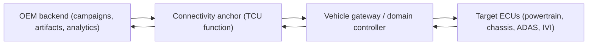
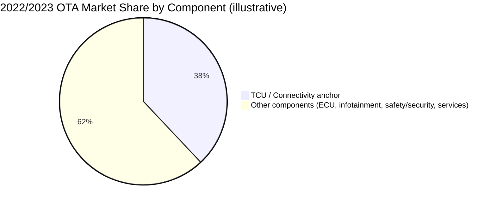
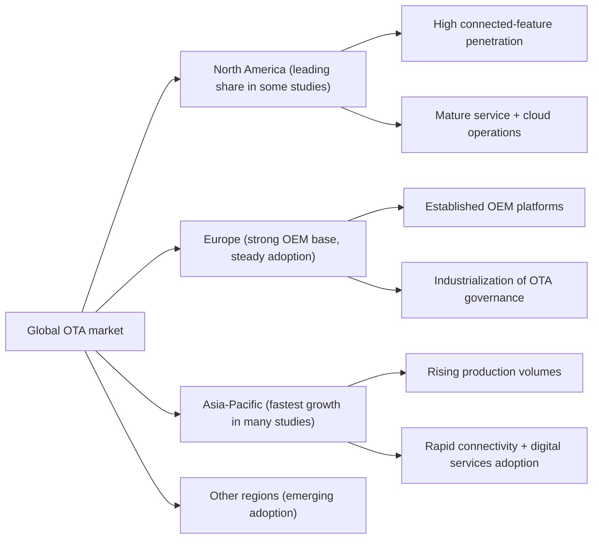
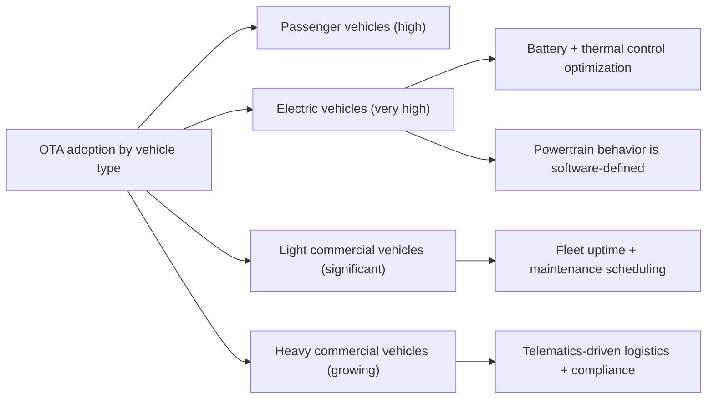

# OTA Market Analysis

## OTA market dynamics as an architectural signal

The automotive OTA market is not just “a software market” growing in the abstract. Its revenue split is a proxy for how OEMs are physically building connected vehicles. When a market report says connectivity or TCUs dominate, what it is really telling you is that the bottleneck for OTA adoption is often not the update logic itself, but the presence of a reliable, managed communications and orchestration node in the vehicle. In other words, market structure reflects system architecture: where OEMs choose to anchor trust, connectivity, campaign control, and telemetry collection is where the money tends to pile up.

Many market analyses now frame automotive OTA as a fast-growing segment driven by the rise of connected vehicles, electrification, and software-defined features. One example estimate places the automotive OTA update market at roughly USD 3.8B in 2023 with strong growth through the next decade. ([Global Market Insights Inc.][1])

## Why the TCU tends to dominate component economics

A Telematics Control Unit (TCU), or a functionally equivalent connectivity module integrated into a gateway/domain controller, is the practical bridge between cloud campaign management and the in-vehicle ECU network. It terminates mobile network connectivity, runs the OTA client (or hosts the handoff to it), enforces policy, and coordinates distribution and status reporting. Even in architectures where updates are installed by a central gateway or high-performance compute (HPC) node, the “TCU function” still exists as a market category because OEMs must pay for modem capability, secure connectivity management, and operational services around provisioning and lifecycle support.

In market segmentation terms, several reports place the TCU category as the largest share within automotive OTA updates. One report attributes about a 38% share to the TCU category (notably reported for 2023 rather than 2022), linking it to growing telematics applications and connected vehicle penetration. ([P&S Intelligence][2]) This aligns with the engineering reality that fleet operations, remote diagnostics, and compliance telemetry all become much easier once you have a managed always-on communication endpoint.

A critical nuance for technical readers is that “TCU dominance” does not necessarily imply a standalone box. OEMs implement the connectivity and OTA orchestration role as either a dedicated module or as an integrated function inside a gateway, cockpit domain controller, or central compute. Market reports typically still count that spend under the connectivity/TCU slice because it is the enabling capability that unlocks the rest of the OTA value chain.

The component dominance story can be illustrated as a market proxy for the in-vehicle architecture.

If we visualize the component split in the same simplified manner you provided, the pie chart is less about finance and more about “where OTA becomes physically possible.”

Because different market studies sometimes assign these percentages to different years and slightly different definitions, the safest interpretation is not “38 is the truth,” but “connectivity/orchestration is structurally the largest enabler category across many segmentations.” ([P&S Intelligence][2])

## Regional distribution: why the market clusters the way it does

Regional OTA revenue shares tend to follow three forces that matter technically. The first is penetration of connected vehicle infrastructure, including carrier coverage, eSIM provisioning ecosystems, and OEM operational maturity in running cloud services at fleet scale. The second is the local concentration of OEMs and tier-1 suppliers that can industrialize OTA across platforms. The third is the regulatory and consumer environment, which shapes how quickly OEMs are pushed toward software-defined maintenance and cybersecurity patch velocity.

North America is frequently reported as the leading region by revenue share in some studies, with figures around the high 30% range and a narrative centered on connected feature adoption and OTA-enabled services. ([GlobeNewswire][3]) Europe is commonly framed as a strong and stable share supported by the presence of established OEMs and early deployment of advanced platform architectures, while Asia-Pacific is widely described as the fastest-growing region, driven by rapidly increasing production volume and accelerating adoption of connected services. ([Growth Market Reports][4])

A compact technical reading of these patterns is that mature connected-service operating models tend to show up first where OEMs already run large-scale cloud operations and where customers expect continuous feature improvement, while fastest growth often appears where production and connectivity adoption curves are steepest.

The “North America ~37%” number specifically appears in widely syndicated market commentary tied to an automotive OTA market outlook report, and it is best treated as one data point among many rather than a universal constant across all analysts. ([GlobeNewswire][3])

## Vehicle type adoption: the software density effect

OTA adoption by vehicle type tends to correlate with how software-dense and connectivity-dependent the platform is. Passenger vehicles drive volume and customer expectation for continuous improvement. Electric vehicles amplify the need because performance, efficiency, charging behavior, thermal management, and even perceived drivability depend heavily on software calibration and controls, which evolve in response to field data. Light commercial vehicles adopt OTA quickly when fleets demand operational efficiency, reduced downtime, and centralized maintenance planning. Heavy commercial vehicles often adopt more slowly due to longer platform lifecycles, conservative validation cycles, and a higher proportion of legacy architectures, but the business case strengthens as logistics, insurance, and financing increasingly depend on telemetry and managed software states.

A useful way to express this is to treat OTA penetration as a function of “software value per kilometer.” EVs and fleet vehicles typically score high.

Even when the raw penetration varies by geography and OEM, the technical logic is stable: the more the vehicle’s value proposition depends on software, the more OTA stops being optional.

## Growth drivers as engineering constraints

Market growth is often explained with business language, but the underlying drivers are engineering constraints that become non-negotiable as architectures evolve.

Vehicle architecture complexity is a direct driver because multi-ECU systems create a maintenance burden that cannot be addressed economically through service-only updates. As platforms move toward domain controllers and centralized compute, the update unit shifts from “individual ECU reflash” toward “orchestrated software deployment across partitions, containers, and ECUs,” which demands robust backend tooling, reliable connectivity, and secure identity and inventory.

Connectivity penetration is the second driver because OTA is only operationally meaningful when vehicles are consistently reachable and can report inventory and health. Higher bandwidth networks and better carrier integration reduce update time and increase the feasibility of richer update strategies, but they also increase exposure: a permanently connected fleet is a permanently targetable fleet, which means cybersecurity spending and regulatory compliance become baked into the cost structure.

Some market analyses explicitly call out security and privacy concerns alongside cost and infrastructure investment as major challenges for OTA deployment. ([Global Market Insights Inc.][1]) That aligns with the real-world engineering burden: OTA is a supply chain that terminates in safety-relevant systems, so security is not a feature add-on; it is part of the fundamental definition of “OTA.”

## Implementation challenges that shape cost and adoption curves

The highest-cost pieces of OTA programs are often invisible in a simple “update delivered” story. Backend infrastructure must support campaign segmentation, staged rollouts, artifact storage, signing, auditing, and observability. Vehicle-side systems must support secure boot chains, robust installation state machines, and recoverability mechanisms such as A/B partitions for critical firmware. Operationally, OEMs must run a 24/7 pipeline that treats software releases as fleet events, not as occasional service actions.

Regulatory compliance also shapes implementation. Even when a market report focuses on revenue, the engineering organization is increasingly constrained by requirements like UNECE R156 (SUMS) and UNECE R155 (CSMS) in many contracting regions, which pushes OEMs toward auditable processes and demonstrable controls. ([Research and Markets][5])

## Conclusion

The OTA market’s component and regional structure is best understood as an architectural map of where OEMs are investing to make software-defined vehicles operationally sustainable. The persistent dominance of the connectivity anchor (often tracked as the TCU category) reflects the reality that OTA is not primarily an “update package problem,” but a “fleet communications, orchestration, and evidence problem.” Regional differences track connected-service maturity, OEM platform industrialization, and the pace of digital adoption, while vehicle-type penetration is largely governed by software density and operational value.

The headline numbers will vary by analyst and by year, but the direction is consistent: OTA is becoming a baseline capability across segments, and the market will continue to reward architectures that treat OTA as a secure, observable, regulated lifecycle system rather than a file transfer feature.

## References

*   **[Global Market Insights Inc.][1]**: *Automotive Over-The-Air Update Market Size, Forecasts 2032.* Covers market size, growth drivers, and security/privacy challenges.
*   **[P&S Intelligence][2]**: *OTA Automotive Updates Market Size & Demand Forecast to 2030.* Provides data on TCU category share (~38% in 2023) and connectivity orchestration.
*   **[GlobeNewswire][3]**: *Global Automotive OTA (Over-the-Air) Updates Market Outlook.* Reports on North America market share (~37%) and software-defined services.
*   **[Growth Market Reports][4]**: *Automotive Over-the-Air Updates Market Research Report 2033.* Analyzes Asia-Pacific growth trends and regional distribution.
*   **[Research and Markets][5]**: *Automotive Over-The-Air (OTA) Updates Market Report 2025.* Focuses on regulatory compliance (UNECE R155/R156) and implementation challenges.
*   **[Mordor Intelligence][6]**: *Automotive Over The Air Updates Market Size & Share Analysis.* Context for general market trends and segmentation.

[1]: https://www.gminsights.com/industry-analysis/automotive-over-the-air-ota-updates-market
[2]: https://www.psmarketresearch.com/market-analysis/automotive-over-the-air-ota-updates-market
[3]: https://www.globenewswire.com/news-release/2023/02/27/2616304/28124/en/Global-Automotive-OTA-Over-the-Air-Updates-Market-Outlook-Report-2023-A-13-959-Billion-Market-by-2030-with-Software-Accounting-for-80-Market-Share-in-2022.html
[4]: https://growthmarketreports.com/report/automotive-over-the-air-updates-market
[5]: https://www.researchandmarkets.com/reports/5806896/automotive-over-the-air-ota-updates-market
[6]: https://www.mordorintelligence.com/industry-reports/automotive-over-the-air-updates-market
