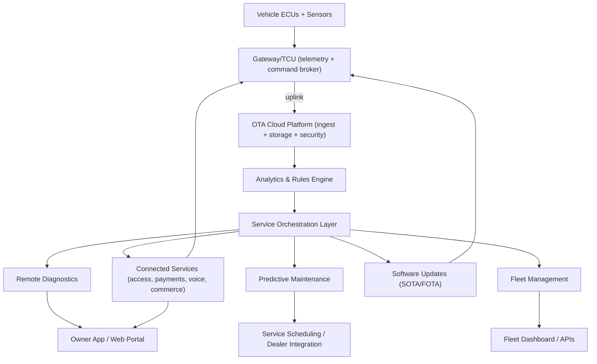
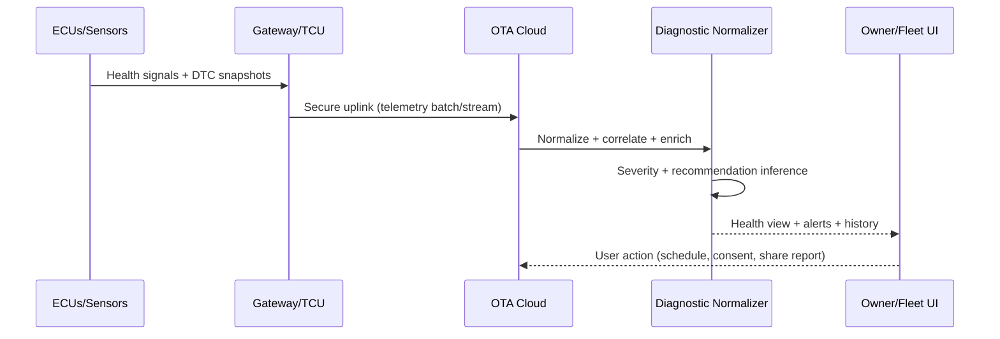
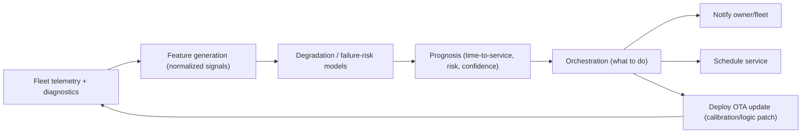
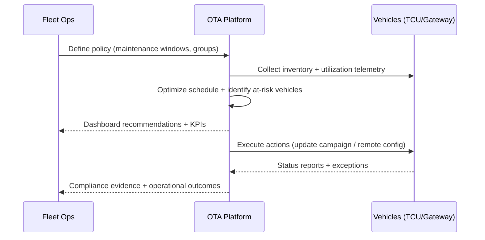
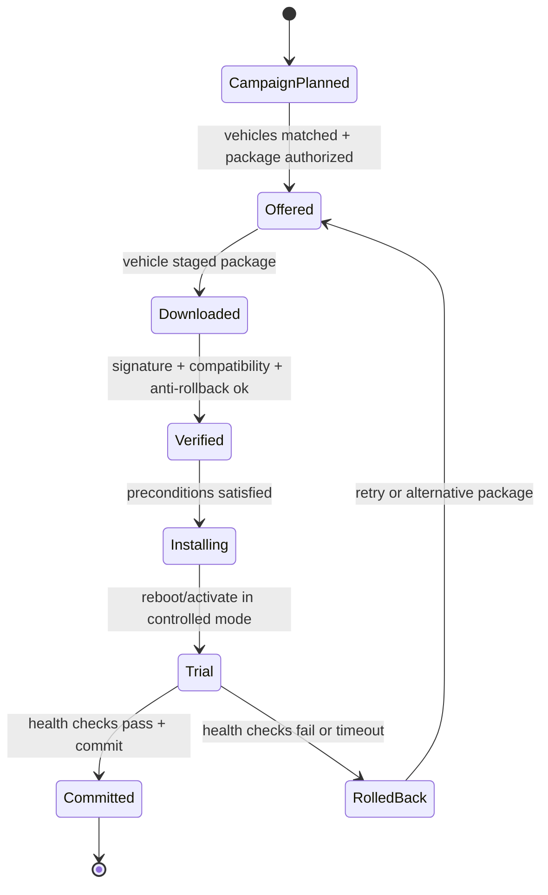
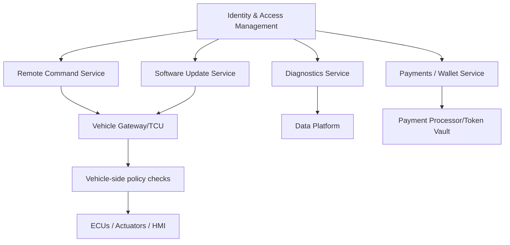

# OTA Services

## OTA services as a closed-loop cyber-physical platform

An automotive OTA platform is best understood as a closed-loop control system that happens to include software updates. Vehicles generate telemetry and diagnostic signals, a cloud platform turns those signals into decisions, and the platform then either delivers information to humans or sends commands and software back to vehicles. When this loop is engineered well, it turns “connected” from a marketing adjective into an operational capability: continuous health visibility, prediction of failures before they occur, fleet-wide optimization, and controlled software evolution (SOTA/FOTA) with auditability.

The architecture usually begins in the vehicle with a telematics and gateway layer that aggregates signals from ECUs, normalizes them, applies local policy, and transmits them to the backend. In the backend, ingestion, storage, analytics, and service orchestration convert raw data into service outcomes. Those outcomes are delivered through stakeholder-specific interfaces, including mobile apps for individual owners, dashboards and APIs for fleets, and engineering/operations tooling for OEMs.

A key practical point is that this is not one monolith. Even when a vendor markets “an OTA platform,” the deployed system is typically a federation of services with different latency and reliability goals. Remote lock/unlock wants near-real-time command delivery, predictive maintenance wants correct long-horizon statistics, software update delivery wants high integrity and strict governance, and fleet analytics wants scalable data warehousing. Treating these as one pipeline is how teams end up with fragile systems and miserable on-call rotations.

## Remote diagnostics as a telemetry-to-decision service

Remote diagnostics, often marketed as self-service diagnostics, starts with the idea that many “service visits” are fundamentally information gaps. Owners and fleet operators want to know whether a symptom is urgent, whether the vehicle is safe to continue operating, and what the likely remediation is. Technically, this service is a structured interpretation pipeline that converts ECU signals and diagnostic trouble codes into a human-facing narrative with confidence levels, severity classification, and recommended actions.

The vehicle side collects health signals from multiple sources, including standardized diagnostic data (where available), ECU-specific status registers, and sensor-derived metrics such as tire pressure and battery state. That data is transported via the connectivity layer to the backend, where it is mapped into canonical models, correlated with context such as ambient temperature or driving state, and presented in a consumable form. The same pipeline supports OEM engineering by enabling population-level analysis and by revealing which failure modes correlate with usage patterns, geography, or component suppliers.

This is also where privacy and access control stop being “legal boilerplate” and become a technical requirement. Remote diagnostics implies collecting and storing data that may include location, driving behavior proxies, and vehicle identifiers. In practice, OTA service platforms increasingly align with “extended vehicle” style access models where vehicle data is made accessible via controlled web services with explicit security and authorization concepts; the ISO 20078 extended vehicle web services family is one standardized approach in this direction. ([ISO][1])

When remote diagnostics is mature, it becomes a bidirectional service. The platform doesn’t only “display data,” it can request targeted snapshots, trigger ECU self-tests where allowed, and guide the vehicle into controlled diagnostic states. That’s a design choice that must be governed carefully because adding remote actuation expands the attack surface and increases the need for strong authorization boundaries.

## Predictive maintenance as a multi-timescale estimation problem

Predictive maintenance is what happens when remote diagnostics stops being episodic and becomes continuous. The platform is no longer answering “what is wrong now,” but estimating “what will be wrong soon,” and “how should we act to prevent it.” The engineering challenge is that vehicles degrade across multiple timescales. Some failures have rapid onset (a sensor becomes intermittent), others are slow wear processes (brake pads, bushings), and others are statistical risk accumulations driven by environment (corrosion exposure) or driving style.

A robust predictive maintenance pipeline usually has three layers. The first is data engineering that produces stable, comparable features across vehicle variants. The second is model logic that estimates degradation or failure probability. The third is orchestration logic that translates predictions into actions: notifying an owner, scheduling service for a fleet, pushing a calibration update, or changing an operating strategy that reduces stress on a component.

The most “OTA-ish” part is that predictive maintenance can close the loop with software actions. If the platform detects a degradation pattern that can be mitigated by changing control parameters or updating diagnostic thresholds, it can initiate an OTA deployment to adjust behavior, extend component life, or improve detection quality. This is where OTA services become an operational control plane, not just a communication system.

If your organization is operating in a regulated type-approval environment, the moment predictive maintenance starts triggering software updates you are effectively touching software update governance obligations. ISO 24089 describes requirements and recommendations for software update engineering for road vehicles at organizational and project levels, and it is highly relevant once “service logic” can initiate update campaigns. ([ISO][2])

## Fleet management as distributed operations, not just tracking

Fleet management is where OTA services typically deliver the clearest ROI because fleets experience cost as downtime and operational friction. Technically, fleet services are the combination of centralized visibility, policy enforcement, and coordinated action across a vehicle population. The platform aggregates status, utilization, and health across the fleet and turns that into decisions about routing, scheduling, maintenance timing, and software baseline management.

The most important distinction from “consumer connected services” is that fleets care about consistency and control. A fleet wants to know which vehicles are on which software versions, whether any are out of compliance, and whether an update campaign will disrupt operations. It also wants predictable maintenance windows and evidence trails for auditing and insurance. That pushes fleet OTA services toward strong segmentation and staged rollouts, where vehicles can be grouped by geography, mission criticality, hardware configuration, or business unit, and where campaign policies can enforce timing constraints.

Fleet management is also where security requirements become more operational than theoretical. A compromised fleet dashboard is effectively a fleet-wide control surface. This is one reason secure update frameworks and role separation matter. Uptane, for example, is designed as a compromise-resilient secure software update framework for automobiles, emphasizing resilience even if parts of the update infrastructure are attacked. ([uptane.org][3])

## Software update services as the platform’s safety-critical core

FOTA and SOTA capabilities are the foundational layer that many other OTA services lean on, because the platform needs the ability to fix issues and evolve features remotely. What distinguishes the “software update service” inside an OTA platform from a simple updater is governance, safety gating, recoverability, and evidence. A mature update service manages package creation and signing, compatibility targeting, differential delivery, staged rollouts, vehicle-side preconditions, post-install health checks, rollback, and compliance logging.

Even when the platform also provides remote diagnostics and fleet services, the update subsystem typically has the strictest integrity requirements because it can modify the software running safety-relevant ECUs. This is precisely why modern regulatory frameworks treat software updates as a type-approval concern. UNECE UN Regulation No. 156 defines requirements around software updates and the operation of a Software Update Management System (SUMS) for vehicles under type approval regimes. ([UNECE][4])

A practical way to describe the update service is as an end-to-end state machine that spans cloud and vehicle and has explicit commit/rollback semantics.

The “anti-rollback” and “verification” concepts become non-negotiable once you consider real attackers. Integrity checks are not only about network attackers; they are also about supply chain compromise and credential theft. This is why update services often use layered signing and metadata validation approaches, and why operational controls over keys and release approvals are part of the technical architecture.

## Additional connected services: commands, identity, commerce, and trust boundaries

Beyond maintenance and updates, OTA platforms commonly host connected services that feel consumer-oriented but are still deeply technical in their requirements. Remote access services (lock/unlock, remote start, pre-conditioning) are essentially authenticated remote command delivery with strict safety and abuse-prevention constraints. Digital wallet and toll/charging payments are identity and transaction systems embedded into a vehicle UX, which raises questions about tokenization, secure elements, and revocation workflows. Voice assistants and in-car commerce are hybrid edge/cloud systems that depend on continuous model and capability updates, which often arrive via SOTA mechanisms.

The recurring technical theme is trust boundaries. A remote command plane should not share credentials or privilege domains with the software update plane. Payments should be isolated from vehicle actuation. Voice services should not become a covert channel into safety ECUs. The platform architecture typically enforces this through strong identity and access management, segmented services, hardware-backed key storage in the vehicle, and explicit policy checks before commands are executed.

The extended vehicle concept is relevant here because many connected services are essentially “vehicle data and vehicle functions exposed as controlled services.” UNECE material describing extended vehicle framing emphasizes off-board systems and standardized interfaces as part of connected vehicle application areas. ([UNECE][5])

## Regulatory and process alignment: why “service architecture” includes audits

Once OTA services affect software baselines, security posture, or type-approval relevant behavior, they inevitably intersect with regulatory expectations. UNECE R156 focuses on the software update management system, while UNECE R155 focuses on cybersecurity management system expectations. The practical engineering implication is that your OTA platform must produce auditable evidence of what it did, why it did it, and how it prevented unsafe or unauthorized actions. ISO 24089 complements this by framing software update engineering requirements and recommendations across organizational and project execution. ([ISO][2])

## References

*   **[ISO 20078-1:2021][1]**: Road vehicles — Extended vehicle (ExVe) web services.
*   **[ISO 24089:2023][2]**: Road vehicles — Software update engineering.
*   **[Uptane][3]**: A secure software update framework for automobiles.
*   **[UN Regulation No. 156][4]**: Software update and software update management system.
*   **[The Extended Vehicle Concept][5]**: UNECE presentation on ExVe framing and standards.
*   **[UN Regulation No. 155][6]**: Uniform provisions concerning the approval of vehicles with regard to cyber security and cyber security management system.

[1]: https://www.iso.org/standard/80183.html
[2]: https://www.iso.org/standard/77796.html
[3]: https://uptane.org/
[4]: https://unece.org/transport/documents/2021/03/standards/un-regulation-no-156-software-update-and-software-update
[5]: https://unece.org/sites/default/files/2021-02/GRVA-09-12e.pdf
[6]: https://eur-lex.europa.eu/legal-content/DE/TXT/PDF/?uri=OJ%3AL_202500005
