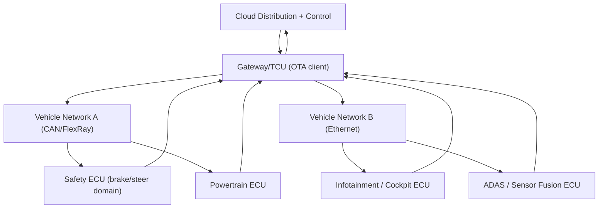
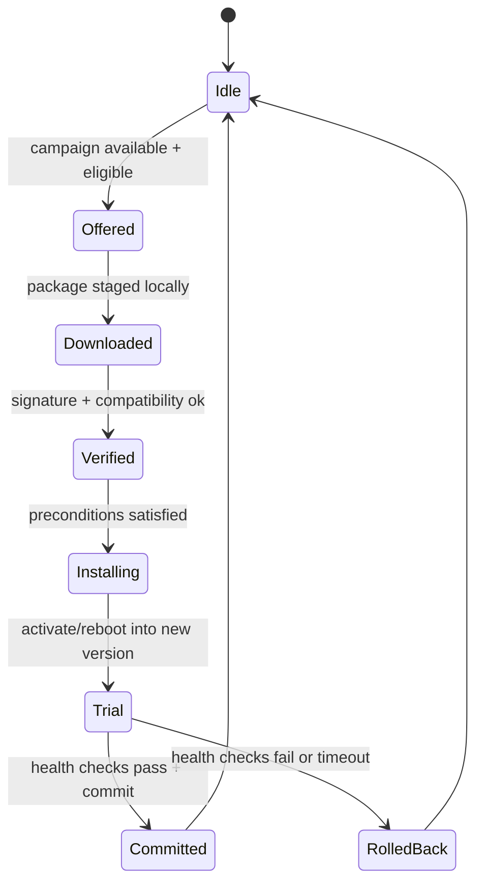
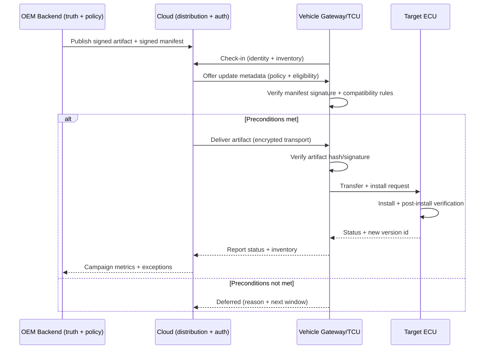
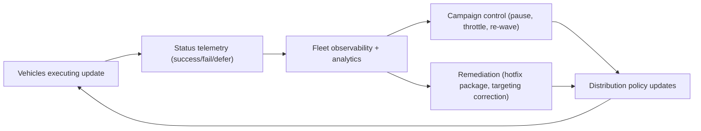

# OTA Update Architecture 

## Introduction

An automotive OTA system is a distributed, safety-relevant software delivery pipeline whose “endpoints” are not laptops but vehicles operating under unpredictable power, connectivity, and environmental conditions. The high-level picture of “cloud talks to car” hides the parts that actually determine whether OTA is safe and scalable: variant-correct targeting, cryptographic trust enforcement, installation state machines with explicit commit/rollback semantics, and fleet-level observability that can stop or reshape campaigns when reality deviates from expectation.

Regulatory and standards pressure has also pushed OTA architecture away from being an internal OEM convenience and toward being an auditable lifecycle system. UNECE UN Regulation No. 156 formalizes the expectation that manufacturers operate a Software Update Management System (SUMS) that controls software updates end-to-end and can provide evidence of compliance. ([UNECE][1])  On the engineering side, standards such as ISO 24089 define terminology and requirements/recommendations for software update engineering across the supply chain, which maps directly onto the architecture described here. ([ISO][2])

## The three-domain architecture and why it exists

A practical OTA architecture splits into three domains because each domain has a different job, a different threat model, and different scaling constraints. The OEM backend domain owns truth: which software exists, which vehicles are eligible, which campaign is authorized, and how evidence is retained. The cloud infrastructure domain owns reach and protection: scalable distribution, identity enforcement, encryption in transit, and operational controls like throttling or regional rollout. The vehicle domain owns safe execution: it must verify authenticity and compatibility, enforce preconditions, perform installation reliably, and guarantee recoverability.

```mermaid
graph LR
  subgraph OEM["OEM Backend Domain (source of truth)"]
    DM["Device & Variant Management"]
    PKI["Signing / Release Authorization"]
    CAMP["Campaign Orchestration & Policy"]
    AUD["Audit & Evidence Store"]
    DM --> CAMP
    PKI --> CAMP
    CAMP --> AUD
  end

  subgraph CLOUD["Cloud Infrastructure Domain (reach + protection)"]
    ID["Identity / AuthN / AuthZ"]
    ART["Artifact Storage + CDN/Distribution"]
    CTRL["Fleet Controls (rate, phasing, stop)"]
    OBS["Telemetry Ingest + Monitoring"]
    ID --> ART
    ART --> CTRL
    CTRL --> OBS
  end

  subgraph VEH["Vehicle Domain (safe execution)"]
    TCU["Gateway/TCU (OTA client + broker)"]
    ECUS["Target ECUs (safety, powertrain, IVI, etc.)"]
    TCU --> ECUS
  end

  CAMP -->|publish signed artifacts + metadata| ART
  ID <-->|mutual auth / tokens / certs| TCU
  ART -->|secure delivery| TCU
  TCU -->|status + inventory| OBS
  OBS --> AUD
```

This separation is not cosmetic. It allows you to harden the trust boundary where it matters. If you collapse “backend truth” and “distribution reach,” you tend to end up with brittle security and poor auditability. If you collapse “vehicle execution” into “cloud control,” you tend to violate safety constraints because vehicles must be able to refuse unsafe actions locally.

## OEM backend system: variant truth, targeting, and authorization

The backend device management system is the authoritative registry of vehicle identities, hardware/software inventories, and configuration variants. It is responsible for deciding what “correct” means in a fleet that contains different models, option packages, regional homologation constraints, ECU hardware revisions, and mid-life supplier changes. The most common root cause of catastrophic OTA events is not a broken downloader; it is variant mismatch where a package is technically valid but not valid for *that* vehicle configuration.

In a mature architecture, the backend does not only store “a software file.” It stores an artifact plus a compatibility contract expressed in metadata. That metadata binds the artifact to explicit prerequisites such as ECU hardware IDs, required base software versions, dependency relationships, and anti-rollback constraints. These contracts are signed as part of the release process so they cannot be altered downstream without detection.

Backend authorization is also where you keep OTA from becoming a fleet-wide remote code execution surface. The release pipeline must enforce role separation and controls around signing keys and campaign initiation. Frameworks like Uptane exist specifically to reduce the blast radius of backend compromise by structuring signed metadata and separating roles such that compromise of one server does not automatically enable arbitrary updates. ([uptane.org][3])

## Cloud infrastructure: distribution at scale with security invariants

The cloud domain exists because distributing multi-gigabyte firmware images or frequent application updates to hundreds of thousands of vehicles is a network and operations problem as much as a software problem. The cloud layer typically provides artifact storage, content distribution, and session handling while enforcing authentication and authorization for vehicles. It also collects progress and health telemetry, which is not a nice-to-have: it is the mechanism that allows campaign governance in real time, including pausing a rollout when failure rates spike or when a regional carrier outage appears.

Cloud security mechanisms should be designed so that the cloud is not a single point of total trust. Transport encryption and authenticated sessions protect against interception and tampering in transit, but the deeper invariant is that the vehicle must validate signed metadata and artifact integrity locally even if the distribution channel is untrusted. This is the same “trust the signature, not the pipe” philosophy that underpins secure update frameworks. ([uptane.org][3])

## Vehicle-side architecture: the gateway/TCU as the update coordinator

In the vehicle domain, the gateway ECU or TCU acts as the update broker. It is the primary interface to the cloud, and it orchestrates updates across target ECUs that may live on different in-vehicle networks, may have different flashing protocols, and may have different safety requirements. The gateway downloads packages, validates them, stages them, distributes them to ECUs, aggregates status, and reports back to the backend.

This gateway-centered pattern is also how modern platform standards express update capability. AUTOSAR Adaptive, for example, standardizes update and configuration management capabilities, including version reporting, buffering updates, resource checks, activation, rollback, and logging/progress reporting. ([autosar.org][4])  The technical significance is that “update” is treated as a platform service with defined APIs and lifecycle semantics, not as a bespoke feature hidden in each ECU.

A realistic vehicle internal view is hierarchical: cloud talks to gateway, gateway talks to ECUs, ECUs enforce their own safety-critical rules, and the gateway consolidates the outcome.

## Functional areas as interacting control loops

### Device management as a correctness engine

Device management is the part of the system that prevents “wrong software to wrong car.” It maintains mappings between vehicles and their eligible software baselines, and it evolves as the fleet evolves. The hard part is that eligibility is not a single lookup; it is often a rule set that depends on hardware BOM, regional regulations, installed features, and prior update history. When this layer is weak, the cloud ends up distributing correct artifacts to incorrect targets, which is how you get misflashing and vehicle malfunctions.

### Process control as a safety gate and state machine

Process control determines when an update may proceed and how execution is sequenced. Vehicles are not stable server racks; they are cyber-physical systems. A process control design that does not model preconditions and atomic commit points will eventually cause bricked ECUs in low-voltage scenarios, partial updates during connectivity drops, or unsafe update attempts during driving.

A clean way to represent process control is as a state machine with explicit staging, verification, installation, trial activation, and commit.

This pattern matches what platform standards describe in different language as activation/rollback behaviors and progress logging. ([autosar.org][4])

### Administration as fleet observability and intervention

Administration is the operational layer that turns a rollout into a managed process rather than a leap of faith. Dashboards and APIs exist so operators can see target populations, completion rates, failure clusters, and root-cause indicators. The deeper architectural requirement is that telemetry must be structured and timely enough to support control actions like pausing a campaign, changing rollout waves, or issuing a remedial update to a subset.

This is also where compliance evidence is gathered in practice. Under frameworks like UNECE R156, manufacturers must demonstrate controlled update processes (SUMS) and retain records that support audit and conformity. ([UNECE][1])

### Client access as policy-driven authority

Client access describes who can trigger what. Some systems allow only OEM-initiated campaigns. Others allow fleet managers to trigger updates for owned vehicles within policy constraints. Some allow end users to choose installation timing. Architecturally, this is an identity and authorization problem: triggers must be authorized, and authorization must be scoped to the minimum necessary power.

A robust design avoids a single “god mode” API. Instead, it enforces distinct roles and privileges, so “view diagnostics” is not adjacent to “flash safety ECU firmware.” This is consistent with compromise-resilience principles emphasized by secure update frameworks such as Uptane. ([uptane.org][3])

## Secure communication and the OTA transaction flow

Secure OTA is not only encryption-in-transit. It is mutual authentication, signed metadata, integrity verification, and safe execution controls. Encryption protects the confidentiality of artifacts and telemetry on the wire. Authentication ensures the cloud is talking to a legitimate vehicle and the vehicle is talking to a legitimate service. Integrity verification ensures the artifact and its metadata have not been altered. Compatibility checks ensure the artifact is appropriate for that ECU and configuration. Preconditions ensure the vehicle is in a safe state to perform the update.

This flow lines up with the “process and evidence” expectations that ISO 24089 frames at a software update engineering level, and with the governance expectations of UNECE R156 at a regulatory level. ([ISO][2])

## Failure handling and status management as core architecture, not an afterthought

Failure is normal in OTA because vehicles have intermittent connectivity, variable battery state, and diverse ECU behaviors. A safe architecture assumes failure and designs for recoverability. In the backend, campaign tooling must identify systemic failures early through aggregated telemetry, not after customer complaints. In the cloud, distribution services must handle partial downloads and retries without producing inconsistent states. In the vehicle, the update client must guarantee that an interrupted update does not leave the ECU unable to boot, which typically implies staging into an inactive slot and only committing after validation for firmware-class updates.

AUTOSAR Adaptive’s update management specifications explicitly describe responsibilities such as buffering updates, checking resource availability, and supporting activation and rollback, reflecting that failure handling is part of the platform contract. ([autosar.org][4])  From a governance standpoint, UNECE R156 expects manufacturers to manage update risks and ensure that failures do not compromise safety, which pushes architectures toward explicit rollback strategies and safe-state behavior. ([UNECE][1])

A practical fleet-level view of failure handling is a feedback loop where telemetry drives control actions.

When this loop is engineered well, failures become data, not disasters. The system can stop a rollout, quarantine a problematic variant cluster, and deploy a corrected package without turning the update infrastructure into a chaos engine.

## Summary

A production-grade OTA architecture is a three-domain system that separates backend truth and governance, cloud distribution and security enforcement, and vehicle-side safe execution. The backend’s central responsibility is correctness in targeting and authorization. The cloud’s central responsibility is scalable reach with strong identity and operational control. The vehicle’s central responsibility is enforcing trust and safety locally through verification, precondition gating, and recoverability mechanisms coordinated by a gateway/TCU. Standards like ISO 24089 and platform specifications like AUTOSAR Adaptive’s update management formalize many of these architectural necessities, while regulations like UNECE R156 formalize the expectation that manufacturers can prove they govern updates through a SUMS with auditable evidence. ([ISO][2])

## References

### Regulations & Compliance
*   **UNECE UN Regulation No. 156**: Software update and software update management system. [Official Page][1]
*   **EU Regulation 2021/388**: Legal text referencing SUMS definitions. [EUR-Lex][5]

### Industry Standards
*   **ISO 24089:2023**: Road vehicles — Software update engineering. [ISO OBP][2]
*   **AUTOSAR Adaptive Platform**:
    *   [Update & Configuration Management (SWS UCM)][4]
    *   [Vehicle Update & Configuration Management (SWS VUCM)][6]

### Security Frameworks
*   **Uptane**: A secure software update framework for automotive applications. [Official Site][3]

[1]: https://unece.org/transport/documents/2021/03/standards/un-regulation-no-156-software-update-and-software-update
[2]: https://www.iso.org/obp/ui/en/
[3]: https://uptane.org/
[4]: https://www.autosar.org/fileadmin/standards/R23-11/AP/AUTOSAR_AP_SWS_UpdateAndConfigurationManagement.pdf
[5]: https://eur-lex.europa.eu/eli/reg/2021/388/oj/eng
[6]: https://www.autosar.org/fileadmin/standards/R23-11/AP/AUTOSAR_AP_SWS_VehicleUpdateAndConfigurationManagement.pdf
