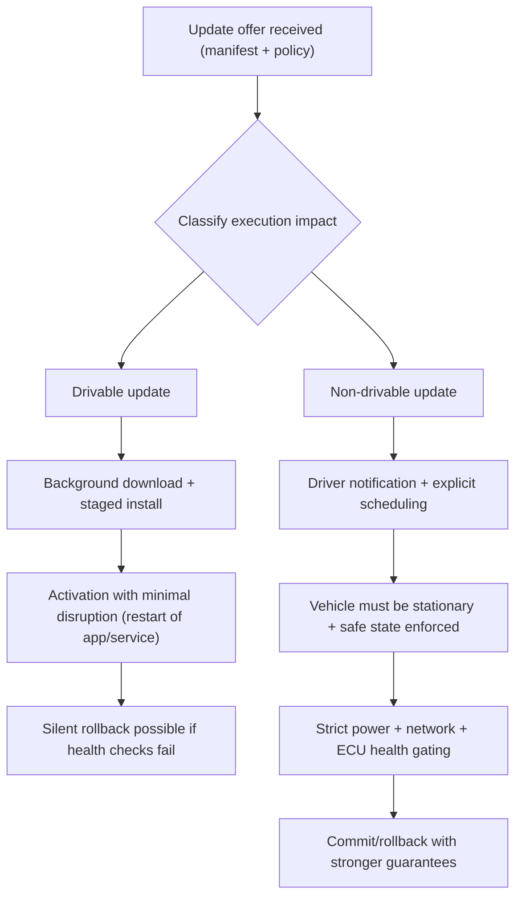
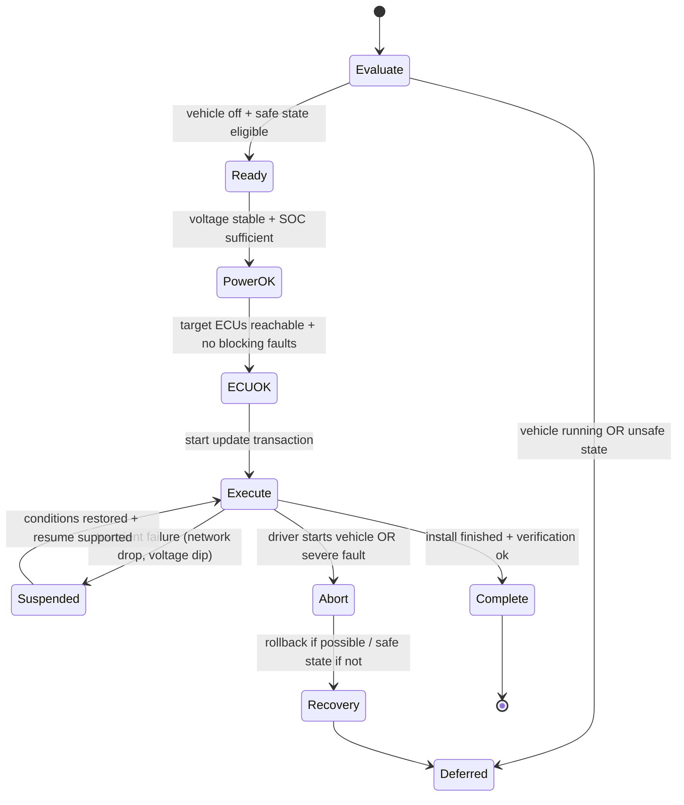
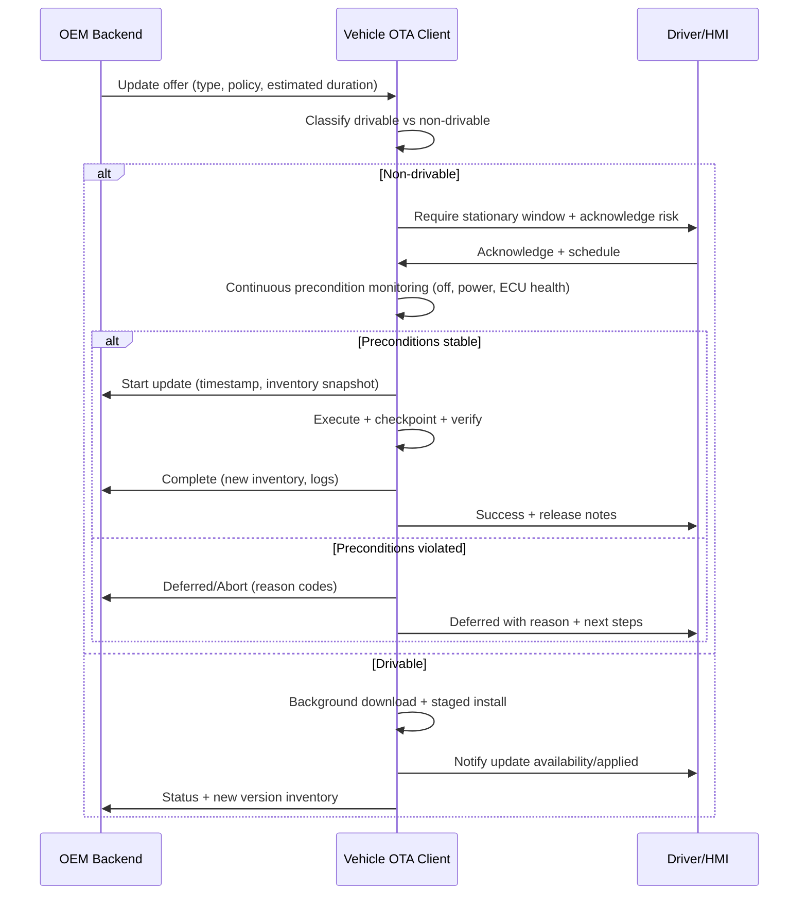

# Vehicle State Preconditions and Execution Requirements

## Why preconditions exist in the first place

Vehicle state preconditions are the safety valve of the OTA pipeline. The OEM backend can decide that an update *should* happen, but only the vehicle can decide whether an update *may* happen right now. That distinction is not philosophical; it is mechanical. Vehicles live in a world of low battery, intermittent networks, temperature swings, and drivers who will absolutely start the car at the worst possible time. A robust OTA system therefore treats precondition evaluation as a first-class runtime control loop that continuously answers one question: “Can I execute this update without creating an unsafe vehicle state or a degraded user experience?”

Regulators reinforce this expectation. The EU publication that implements UNECE R156 language explicitly calls out that software updates must only execute when the vehicle has enough power to complete the update process, including recovery to a previous version or placing the vehicle into a safe state. ([EUR-Lex][1])  ISO 24089 frames software update engineering as an end-to-end discipline for road vehicles, which implicitly includes the engineering of safe execution and risk management across deployment. ([ISO][2])

## Two execution classes: “drivable” vs “non-drivable” as a contract with the user

The drivable/non-drivable split is useful because it makes “vehicle operability impact” explicit. A drivable update is one whose installation and activation can occur without disabling safety-relevant functions needed for normal operation. A non-drivable update is one that temporarily makes one or more critical functions unavailable, or introduces a transitional state where the vehicle cannot guarantee safe behavior. In practice, this maps closely to the difference between updating user-facing applications or data (often SOTA-like) and updating firmware or safety-critical ECU software (often FOTA-like), but the real classifier is operational impact, not package type.

The classification decision is also a communication decision. Drivable updates can be designed to fade into the background, while non-drivable updates must establish a clear “maintenance window” contract with the driver because the vehicle is going to intentionally enter a restricted state.

## Drivable updates: continuous improvement with bounded risk

Drivable updates are designed to behave like “software maintenance without ceremony.” They typically target infotainment applications, connectivity features, maps, media codecs, UI components, and other functions where a failure is annoying but not safety-critical. The vehicle can download and install these updates in the background, often deferring activation until a convenient moment such as an infotainment restart. If automatic updates are disabled, the system often shifts from “background autonomy” to “user-assisted readiness,” prompting the driver to connect to Wi-Fi or approve cellular usage, then proceeding when connectivity is available.

The architectural property that makes drivable updates manageable is recoverability without endangering the boot chain. The platform usually keeps the previous version staged, and activation is a reversible pointer flip rather than a destructive overwrite. If the updated component fails a post-activation health check, rollback can occur quickly, often without affecting the rest of the vehicle’s functional domains.

This model aligns strongly with the “update and configuration management” approach standardized in AUTOSAR Adaptive, where receiving/buffering updates, resource checks, activation, rollback, and progress logging are treated as platform-level responsibilities rather than ad-hoc behaviors inside each app. ([autosar.org][3])

## Non-drivable updates: maintenance mode as a safety mechanism

Non-drivable updates dominate when the update touches safety-critical ECUs or any function whose temporary unavailability would make the vehicle unsafe to operate. The reason is straightforward: during flashing, ECUs may reset, enter programming mode, or run minimal bootloaders that do not provide normal runtime behavior. A powertrain ECU, brake controller, steering controller, or gateway managing safety networks cannot be assumed to behave safely while its software image is mid-rewrite.

These updates also tend to be larger and slower. Your provided duration estimate of fifteen to thirty minutes is realistic for firmware-class updates on constrained networks and flash memories, and that time window matters because it increases the probability that something changes mid-update: voltage sags, connectivity drops, the driver gets impatient and tries to start the vehicle, or an ECU reports an unexpected diagnostic fault.

For this reason, non-drivable updates should be modeled as transitions into a dedicated update-safe state, often called “maintenance mode” or “update state.” AUTOSAR documents explicitly describe the idea of putting a machine into a safe state (for example, an “Update State”) to achieve safe update behavior. ([autosar.org][4])

## Precondition validation as a state machine, not a checklist

A common implementation mistake is to treat preconditions as a one-time checklist evaluated at the beginning. In reality, preconditions must be continuously monitored because they can change while the update is executing. The vehicle can be “off” at time T0 and “started” at T0+2 minutes. Voltage can be stable until a door is opened and interior loads spike. Connectivity can drop precisely when an ECU expects the next block.

A safer abstraction is a precondition state machine that only allows progression when gates remain satisfied and that has explicit transitions for deferral, suspension, controlled abort, and recovery.

That “recovery” branch matters because some failure modes are not symmetrical. If the system is mid-flash of a safety ECU, “abort” may not mean “go back to normal immediately.” It may mean “enter safe state, complete recovery flow, then release vehicle.”

## Vehicle-off and “not running” requirements

Your provided material emphasizes the primary rule for critical updates: the vehicle must not be in running state. That requirement exists because the update process can temporarily remove control or monitoring functions. The system should therefore gate execution on clear signals such as ignition state, propulsion enable state, gear position, and parking brake status. The architecture should also define what happens if the driver violates the contract and attempts to start the vehicle. A conservative approach is immediate transition to a protected path: either an abort before flashing begins, or a controlled continuation to a recoverable checkpoint if flashing is already in a critical section, followed by explicit user messaging.

From a compliance viewpoint, this behavior is part of the “safe update execution” story that regulators expect manufacturers to govern in their SUMS, and it’s directly connected to safety and power requirements emphasized in R156-aligned texts. ([EUR-Lex][1])

## Power and battery management: the hidden dominant constraint

Power is the most common practical blocker because flashing is power-sensitive and failure-intolerant. If voltage collapses during flash erase/write, you risk leaving the ECU in a non-bootable state. That is why the system must verify sufficient battery state of charge before beginning and must monitor voltage continuously during execution.

The EU text associated with R156 explicitly requires enough power to complete the update process, including recovery to the previous version or placing the vehicle into a safe state. ([EUR-Lex][1]) This is a key nuance: it’s not enough to have power for the “happy path.” You must have power budget for the “oops” path. For EVs, charging state becomes an additional lever. Some OEM designs prefer executing non-drivable updates during charging because it reduces power risk; others avoid it if charging introduces electrical noise or changes power domain behavior. The correct choice depends on the vehicle’s power architecture and the update mode design, but the precondition logic must treat it explicitly rather than implicitly.

## ECU integrity, diagnostics, and the real-world mess of modifications

The update agent’s job is not merely to flash bytes; it is to orchestrate a distributed embedded system. That orchestration relies on reliable communication with target ECUs and predictable ECU states. Factory-condition vehicles are the easiest case because wiring, power domains, and ECU identities match the OEM’s configuration model. Aftermarket modifications introduce uncertainty: additional loads on power rails, altered wiring, non-standard devices on CAN/Ethernet, or even partial ECU replacements that break compatibility assumptions.

A mature OTA client therefore integrates diagnostics into precondition evaluation. It needs to detect whether target ECUs are reachable, whether they report faults that block programming, and whether the vehicle network is stable enough to sustain a flash session. When the system detects a blocking condition, it should not “try anyway.” It should defer with a reason and report that reason upstream so campaign analytics can distinguish “fleet is offline” from “fleet is incompatible.”

## User communication as an execution control mechanism

For non-drivable updates, user communication is not UX decoration; it is part of the safety system. The driver needs to understand that the vehicle will be unavailable for a defined window and that interruption may have consequences. The system should therefore establish a clear scheduling flow, request explicit acknowledgment where appropriate, and provide continuous progress and outcome messaging.

Bidirectional reporting to the backend is equally important. It enables dashboards to show not only completion rates but also deferral reasons and failure clusters. That feedback loop is how an OEM decides whether to pause a campaign, change rollout waves, or issue revised instructions.

## Security interaction: preconditions also reduce attack surface

While your text focuses on safety and convenience, preconditions also have security value. Attackers often aim to induce unsafe states or exploit partial updates. Strong local policy enforcement, signed metadata, and anti-rollback protections reduce the risk that an attacker can trick a vehicle into installing the wrong thing at the wrong time. Uptane’s standard explicitly treats rollback attacks as a first-class concern, requiring rejection of older metadata to prevent replay/downgrade scenarios. ([uptane.org][5]) This matters because even a “legitimate” update channel becomes dangerous if an attacker can force a vehicle back onto a vulnerable version.

## Conclusion

Vehicle state preconditions are the runtime guardrails that make OTA viable in safety-critical environments. The most robust architectures treat update execution as a continuously monitored state machine, not a one-time checklist, and they bind the drivable/non-drivable classification to both technical safeguards and user communication contracts. Power stability, ECU reachability, diagnostic health, and driver behavior are not edge cases; they are the dominant real-world constraints. When these constraints are encoded into policy, enforced locally, and reported upstream, OTA becomes an operationally scalable system that improves vehicles without compromising safety or trust.

## References

### Regulatory Frameworks
*   **UNECE UN Regulation No. 156** – Software update and software update management system (SUMS). [[6]]
*   **EU Regulation 2021/388** – Power requirement language aligned with R156. [[1]]

### International Standards
*   **ISO 24089:2023** – Software update engineering for road vehicles. [[2]]
*   **Uptane Standard** – Rollback attack handling and secure update rules. [[5]]

### Technical Specifications
*   **AUTOSAR Adaptive (R23-11)** – Update & Configuration Management: activation, rollback, and logging. [[3]]
*   **AUTOSAR Adaptive (R19-11)** – Safe “Update State” concept and state machine reference. [[4]]

[1]: https://eur-lex.europa.eu/eli/reg/2021/388/oj/eng
[2]: https://www.iso.org/standard/77796.html
[3]: https://www.autosar.org/fileadmin/standards/R23-11/AP/AUTOSAR_AP_SWS_UpdateAndConfigurationManagement.pdf
[4]: https://www.autosar.org/fileadmin/standards/R19-11/AP/AUTOSAR_SWS_UpdateAndConfigManagement.pdf
[5]: https://uptane.org/docs/latest/standard/uptane-standard
[6]: https://unece.org/transport/documents/2021/03/standards/un-regulation-no-156-software-update-and-software-update
