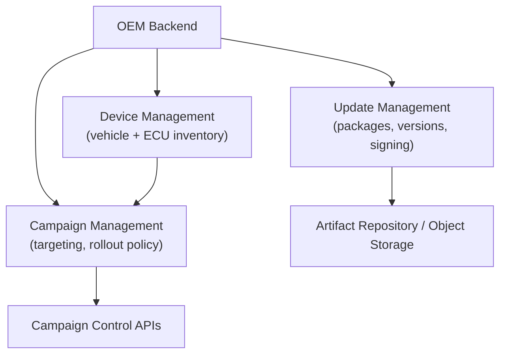
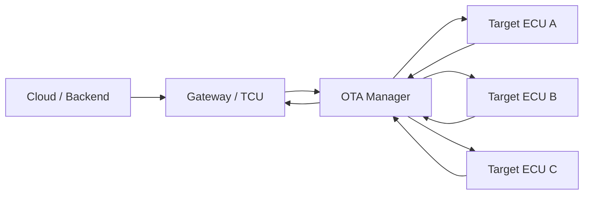
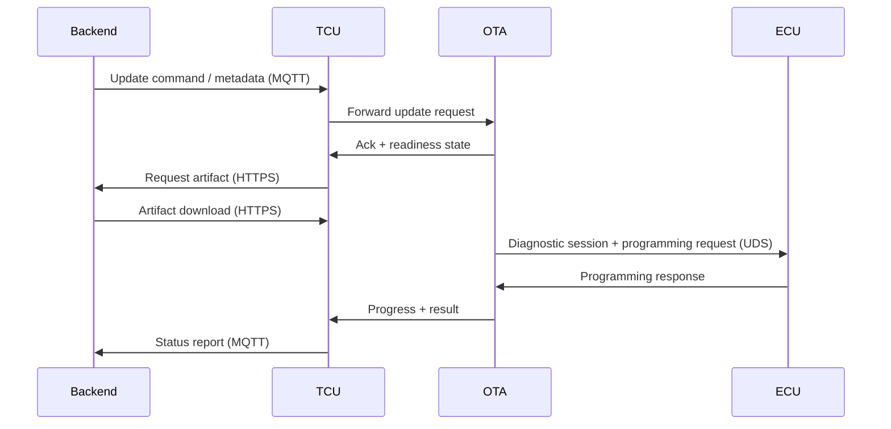

# OTA Architecture

## Introduction and architectural intent

An automotive Over-The-Air (OTA) architecture is not simply a data delivery pipeline; it is a distributed control system whose purpose is to safely evolve software inside vehicles that operate in the physical world. The architecture must balance three competing forces at all times: central control by the OEM, autonomous safety decisions made locally by the vehicle, and scalability across fleets that may contain millions of heterogeneous configurations. The result is a layered architecture in which responsibilities are deliberately separated between backend systems, vehicle gateways, and target ECUs, while communication paths and trust boundaries are tightly controlled.

Although OEM implementations differ in tooling, vendors, and internal interfaces, the conceptual structure is remarkably stable across the industry. This documentation describes that stable structure and explains why each component exists, how data flows through the system, and how execution control is maintained from campaign definition down to ECU flashing.

## OEM backend architecture as the source of truth

The OEM backend is the authoritative domain in the OTA ecosystem. It defines what software exists, which vehicles are eligible to receive it, and under which conditions updates may be executed. Architecturally, it is useful to view the backend as three cooperating but distinct subsystems, because each solves a different class of risk.

The update management subsystem is responsible for software artifacts themselves. It handles versioning, build provenance, validation results, signing, and release readiness. This is where software packages transition from “development output” into “deployable artifacts.” In a mature setup, an update package is never just a binary; it is a binary plus metadata describing compatibility constraints, dependencies, rollback rules, and safety relevance. This metadata is often cryptographically signed together with the artifact so that downstream systems cannot silently alter eligibility rules.

The device management subsystem represents the fleet model. It maintains identities for vehicles, gateways, and ECUs, along with their hardware revisions, regional homologation context, and installed software inventories. This subsystem answers the most dangerous question in OTA: “Is this update allowed on this specific vehicle?” Mistakes here lead to misflashing, which is why device management is usually treated as configuration-critical infrastructure rather than a simple database.

Campaign management builds on both of the above. It translates “this update exists” into “this update should be deployed to these vehicles, in this order, under these policies.” Campaigns encode rollout strategy, timing constraints, retry logic, and stop conditions. They are also the point where operational feedback loops attach, allowing campaigns to be slowed, paused, or aborted if real-world telemetry shows unexpected behavior.

From a governance perspective, this backend domain is what regulators and auditors look at when evaluating a Software Update Management System under UNECE R156, because it embodies the processes that decide what may happen in the fleet.
[https://unece.org/transport/documents/2021/03/standards/un-regulation-no-156-software-update-and-software-update](https://unece.org/transport/documents/2021/03/standards/un-regulation-no-156-software-update-and-software-update)

## Vehicle-side architecture and the role of the gateway

Inside the vehicle, OTA functionality is intentionally centralized. The Telematics Control Unit (TCU), or a functionally equivalent gateway ECU, acts as the single point of contact between the cloud and the internal vehicle networks. This design choice limits attack surface, simplifies trust management, and provides a single coordinator for update execution.

The TCU is responsible for maintaining a secure communication session with the backend, downloading update artifacts, validating their authenticity, and orchestrating installation across multiple target ECUs. It does not simply forward files; it enforces local policy. If the backend proposes an update but the vehicle is in an unsafe state, the TCU must defer or reject execution regardless of backend intent.

Within the vehicle, the OTA manager is a logical component that may be implemented as a service inside the TCU or distributed across cooperating services. Its responsibility is to manage the update lifecycle locally. It evaluates preconditions, sequences update steps, interacts with diagnostic services, and aggregates status from target ECUs. Conceptually, it is the vehicle’s “update brain.”

This pattern aligns closely with platform concepts defined in AUTOSAR Adaptive, where update and configuration management are treated as standardized platform services rather than ad-hoc ECU logic.
[https://www.autosar.org/standards/adaptive-platform/](https://www.autosar.org/standards/adaptive-platform/)

## Communication protocols and separation of concerns

OTA systems almost universally separate control communication from bulk data transfer. This separation is not accidental; it reduces coupling and improves robustness.

Control-plane communication is typically implemented using MQTT or a similar lightweight publish–subscribe protocol. MQTT is well suited for fleet-scale status reporting, command dispatch, acknowledgments, and asynchronous notifications. It allows vehicles to remain connected with minimal bandwidth while enabling backend systems to react quickly to state changes.

Data-plane communication is usually handled over HTTPS. Software packages can be large, and HTTPS provides mature tooling for secure, reliable, resumable transfers. Using HTTPS also integrates naturally with object storage, content delivery networks, and existing cloud security infrastructure.

This dual-channel model also supports security hardening. Even if the transport layer is compromised, update integrity still depends on cryptographic verification of signed metadata and binaries, an approach formalized by frameworks such as Uptane.
[https://uptane.org/](https://uptane.org/)

## User interaction and consent as part of execution control

OTA architecture does not end at ECUs; it includes the driver. User interaction is an execution control mechanism, especially for updates that affect vehicle availability. The OTA manager interfaces with the Human–Machine Interface (HMI) to inform the driver of update availability, required conditions, expected duration, and consequences of interruption.

Some updates may execute automatically in the background, while others require explicit user acknowledgment. The architecture supports both vehicle-initiated and backend-initiated flows. A backend-triggered update might result in a push notification to a mobile application, while a vehicle-initiated update might surface directly on the infotainment display.

This flexibility allows OEMs to balance convenience with safety and regulatory requirements. It also ensures that user decisions are reflected in backend telemetry, enabling accurate reporting of deferred updates and user-driven delays.

## ECU update mechanisms and diagnostic control

Once an update reaches the vehicle, execution relies on established diagnostic mechanisms. The TCU typically acts as a UDS tester, initiating diagnostic sessions with target ECUs and invoking standardized services for download, transfer, and programming. This reuse of diagnostic protocols ensures compatibility with existing ECU bootloaders and minimizes the need for custom flashing logic.

Different ECUs may reside on different networks. Legacy controllers often communicate over CAN or FlexRay, while newer domain controllers and high-performance ECUs may use Automotive Ethernet. The gateway abstracts these differences, routing update data over the appropriate transport while presenting a uniform update workflow to the OTA manager.

This abstraction is critical for scalability. It allows a single OTA architecture to span mixed-network vehicles without exposing backend systems to in-vehicle network complexity.

## Special case: updating the gateway itself

Updating the TCU introduces a bootstrapping problem: the component responsible for OTA must update itself without losing its ability to recover. To solve this, TCUs usually include a dedicated update mechanism, often implemented as a UDS server or a minimal bootloader that remains operational even when the main application is replaced.

Architecturally, this often leads to dual-bank or A/B memory designs, where one partition runs the active software while the other is updated. After verification, control is switched. Single-bank designs are possible but require stricter sequencing and higher risk tolerance.

The need for gateway self-update capability is one reason OTA architectures emphasize recoverability and staged activation. A gateway that cannot recover from a failed update effectively bricks the vehicle’s connectivity layer.

## System integration and lifecycle perspective

When viewed end to end, the OTA architecture forms a closed-loop system. Backend systems define intent, vehicles enforce safety, and telemetry feeds back into operational control. Each component exists to manage a specific class of risk: configuration risk in the backend, distribution risk in the cloud, execution risk in the vehicle.

This architecture scales because it is modular. OEMs can replace cloud providers, change diagnostic tooling, or evolve gateway hardware without breaking the conceptual model. What remains constant are the principles: centralized truth, local safety enforcement, secure communication, and observable execution.

As vehicles become increasingly software-defined, this architecture is no longer optional. It is the infrastructure that enables long vehicle lifecycles, rapid security response, and continuous feature evolution while preserving trust and safety.

## References

| Standard / Framework | Description | Reference |
| :--- | :--- | :--- |
| **UNECE R156** | Software Update Management System (SUMS) regulation | [Official Document](https://unece.org/transport/documents/2021/03/standards/un-regulation-no-156-software-update-and-software-update) |
| **ISO 24089:2023** | Road vehicles — Software update engineering | [ISO Standard](https://www.iso.org/standard/77796.html) |
| **AUTOSAR Adaptive** | Standardized Update and Configuration Management (UCM) | [Specification](https://www.autosar.org/standards/adaptive-platform/) |
| **Uptane** | Secure software update framework for automotive | [Project Site](https://uptane.org/) |
| **MQTT** | Lightweight messaging for control-plane communication | [Official Site](https://mqtt.org/) |
| **ISO 14229 (UDS)** | Unified Diagnostic Services for ECU programming | [ISO Standard](https://www.iso.org/standard/77436.html) |
