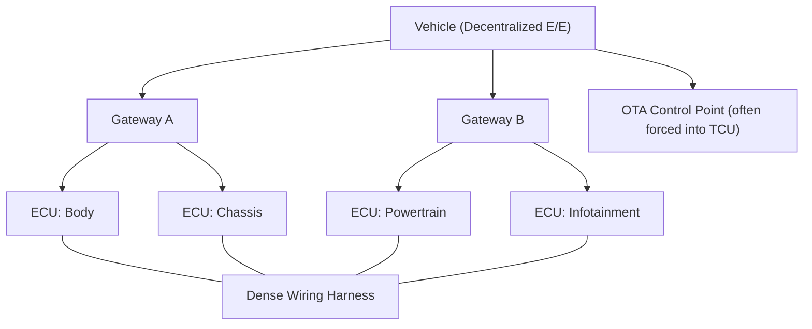
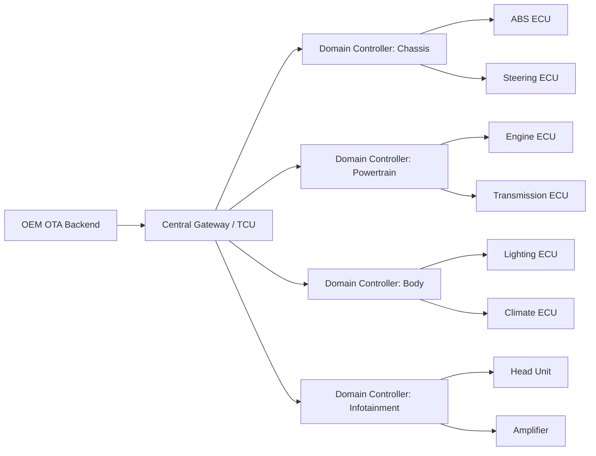
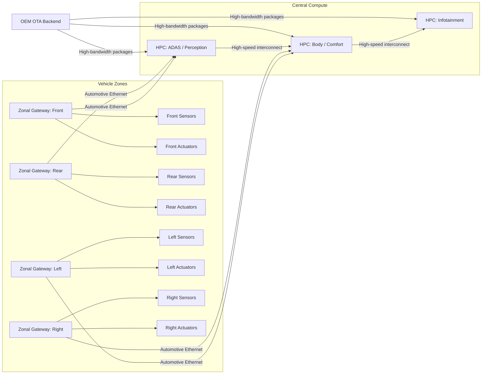
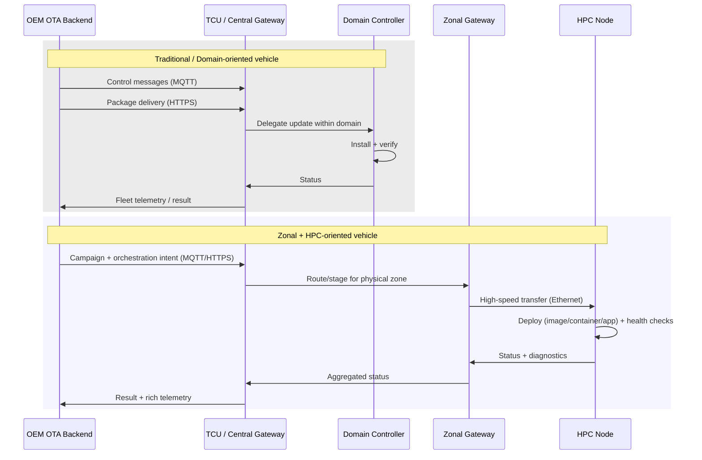

# OTA Architecture and Vehicle Electronic Evolution

## Why vehicle architecture evolution matters for OTA

Over-the-air updating is not “a feature” bolted onto a vehicle. It is a systems property that emerges from how compute, networks, identity, safety boundaries, and diagnostics are designed. As vehicle E/E (electrical/electronic) architectures evolved from scattered microcontroller ECUs toward centralized compute with high-speed networking, the OTA problem changed shape. Early OTA systems could treat the vehicle as a single gateway plus a set of mostly independent targets. Modern architectures force the OTA platform to reason about orchestration across multiple gateways, shared compute resources, virtualization layers, and mixed-criticality workloads running side by side.

The architectural evolution you described—decentralized to domain-based to zonal with HPC—tracks the industry’s attempt to control wiring complexity, integration cost, and feature velocity. Each step also changes where the “update authority” lives, what the update unit of deployment is, and how much data you must move reliably over intermittently connected links.

---

## Decentralized architectures and why OTA is painful there

In the historical decentralized model, ECUs accumulate like geological layers: one ECU per feature, added incrementally, interconnected through gateways that were designed primarily to route traffic rather than to coordinate lifecycle operations. Diagnostics exist, but “update coordination” is not a first-class design goal. The wiring harness becomes a physical manifestation of architectural entropy, increasing weight and cost while limiting the ability to introduce new sensors and compute-intensive functions.

From an OTA standpoint, decentralized architectures push you toward brittle per-ECU update logic. Each ECU may have its own bootloader constraints, memory layout, diagnostic behavior, and permissible programming states. The lack of stable coordination points means the update system must either centralize control in a telematics unit that wasn’t designed to be a fleet-scale deployment orchestrator, or accept fragmented control with inconsistent capabilities across ECUs. That fragmentation also complicates compatibility management because the “vehicle configuration” is effectively distributed and can drift over time.

This is the era where OTA tends to be limited to infotainment or a narrow subset of ECUs, because the systemic coordination and recovery guarantees required for broader coverage are expensive to retrofit.

---

## Domain-based architectures: functional structure creates OTA leverage

Domain architectures are the first big step toward making OTA manageable at scale. Instead of treating every ECU as a peer in a flat network, the vehicle groups compute by function: chassis, powertrain, body, infotainment, and sometimes ADAS as its own domain. A domain controller becomes the coordination nucleus for its area, absorbing integration complexity and reducing the need for cross-domain chatter at the ECU level.

The OTA consequence is subtle but powerful: the unit of orchestration can move upward. The OEM backend and vehicle-side update agent no longer have to micromanage dozens of ECUs directly. They can delegate sequencing, safety gating, and sometimes even package decomposition to domain controllers. That delegation enables more deterministic update windows and clearer safety boundaries, because the domain controller can enforce domain-specific preconditions such as vehicle state, actuator inhibition, or diagnostic session management.

In practice, domain architectures also encourage standardization in how updates are described and applied within a functional cluster. The OEM can define domain-level compatibility constraints and rollout policies, which reduces fleet risk compared to updating scattered ECUs in arbitrary combinations.

---

## Zonal architectures with HPC: physical topology reshapes the update graph

Zonal architecture flips the grouping principle from “what it does” to “where it is.” Instead of having many function-specific ECUs distributed around the vehicle, you have zonal gateways that aggregate sensors/actuators in a physical region and forward traffic over Ethernet to centralized compute resources. High Performance Computers (HPCs) become the main execution platforms for workloads that used to be fragmented across microcontroller ECUs.

This is not just a wiring optimization. It changes the software platform model from “firmware on many ECUs” toward “applications on shared compute,” often running under hypervisors or containerized environments. As a result, OTA must increasingly support software delivery patterns familiar from data centers: image-based updates, A/B partitions, snapshot rollback, staged deployments, and workload-level health checks.

This architecture reduces harness complexity and makes scaling easier, but it forces the OTA system to become much more orchestration-heavy. Updating an HPC may affect multiple vehicle functions simultaneously, including mixed-criticality workloads. The OTA workflow must understand dependency graphs, safe degraded modes, and strict sequencing rules so that, for example, an infotainment update does not starve a safety-related real-time workload of CPU or network bandwidth.

---

## High Performance Computing in vehicles, demystified for OTA engineers

An automotive HPC is best understood as a compute consolidation node rather than a magical intelligence box. It runs software, and the sophistication comes from the software stack you deploy on top: operating systems (often Linux variants in the Adaptive AUTOSAR ecosystem), hypervisors for isolation, middleware for service-oriented communication, and acceleration frameworks for AI workloads. The OTA system’s job is to deliver and activate that software safely, verify it cryptographically, and prove that the platform is healthy after deployment.

HPC-centric architectures also alter what “ECU update” means. Instead of flashing a microcontroller with a single monolithic firmware image, you may deliver multiple artifacts: a base OS image, a hypervisor or kernel update, one or more container images, and application-level configurations. The system must support robust rollback because the blast radius of failure is larger: a bad update on a centralized compute node can degrade multiple features at once.

Cloud computing in this context becomes complementary. The vehicle cannot outsource real-time control loops to the cloud, but the cloud can support fleet analytics, training pipelines, and update campaign control. OTA telemetry becomes more valuable because it can feed a feedback loop: detect faults, segment populations, and adjust rollout strategy, a pattern that maps nicely onto progressive delivery concepts.

---

## OTA implications across the evolution: control plane, data plane, and orchestration

In the older TCU-centric model, MQTT is often sufficient for control signaling and HTTPS for package download because packages are smaller and the number of major update targets is limited. In an HPC-driven architecture, both protocols can remain relevant, but the system design must address a new set of bottlenecks: large artifacts, multi-node distribution inside the vehicle, and tight coupling between software components.

The OTA backend must evolve from “send update to vehicle” toward “deploy software to a distributed in-vehicle compute fabric.” That means richer manifests, explicit dependency and compatibility metadata, and more granular status reporting. On the vehicle side, you need a lifecycle manager that can coordinate zone gateways, domain controllers (if present), and HPCs, while enforcing safety constraints and dealing with partial connectivity or partial installation outcomes.

The following diagram captures the difference between a more traditional flow and a zonal/HPC flow without pretending that one is universally “better”; they are different problem spaces.

The key point is that the OTA system becomes increasingly “distributed systems-like” as the vehicle becomes more centralized in compute. The paradox is real: fewer compute nodes can mean more orchestration complexity because each node becomes more critical.

---

## Cybersecurity pressure increases with centralization and connectivity

Zonal gateways and HPCs expand the attack surface because they concentrate privilege and connectivity. A compromise of an HPC can potentially expose multiple domains, and a compromise of a zonal gateway can provide access to a physically broad set of sensors and actuators. High-speed Ethernet links create opportunities for lateral movement inside the vehicle if segmentation and authentication are weak.

OTA itself is an attractive attack vector because it is a legitimate mechanism for remote code delivery. That is why modern OTA designs anchor trust in a hardware-backed root of trust, use signed metadata and signed targets, and implement strict verification at each step of the update pipeline. This aligns with industry frameworks such as Uptane, which was designed to secure automotive software updates against common threats like repository compromise, man-in-the-middle attacks, and rollback attacks.

Architecturally, cybersecurity is not a separate subsystem that you “add.” It is a set of invariants enforced by identity, cryptography, secure boot, network segmentation, and update verification across backend and vehicle.

---

## References

- MQTT v5.0 Specification (OASIS)
[https://docs.oasis-open.org/mqtt/mqtt/v5.0/mqtt-v5.0.html](https://docs.oasis-open.org/mqtt/mqtt/v5.0/mqtt-v5.0.html)
- ISO 14229 Unified Diagnostic Services (UDS) overview (ISO catalogue landing page)
[https://www.iso.org/standard/72439.html](https://www.iso.org/standard/72439.html)
- UNECE Regulation R156 (Software Update Management Systems)
[https://unece.org/transport/documents/2021/06/standards/un-regulation-no-156](https://unece.org/transport/documents/2021/06/standards/un-regulation-no-156)
- ISO/SAE 21434 Road Vehicles Cybersecurity Engineering (ISO catalogue landing page)
[https://www.iso.org/standard/70918.html](https://www.iso.org/standard/70918.html)
- Uptane: Security framework for automotive OTA updates (project documentation)
[https://uptane.github.io/](https://uptane.github.io/)
- AUTOSAR Adaptive Platform (official overview)
[https://www.autosar.org/standards/adaptive-platform/](https://www.autosar.org/standards/adaptive-platform/)
- OPEN Alliance (Automotive Ethernet ecosystem)
[https://www.opensig.org/](https://www.opensig.org/)
